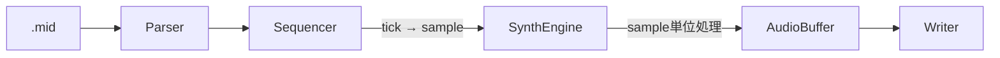
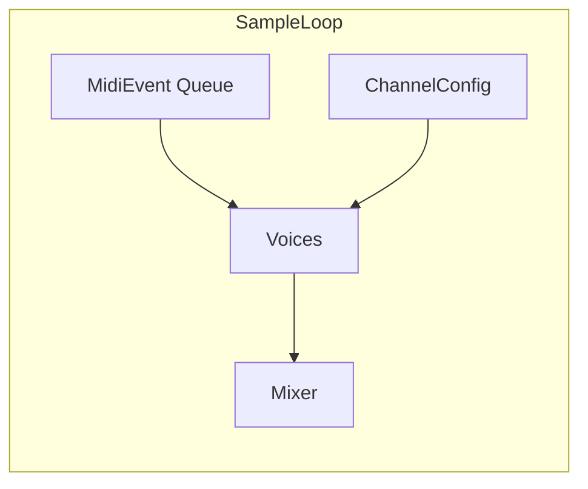
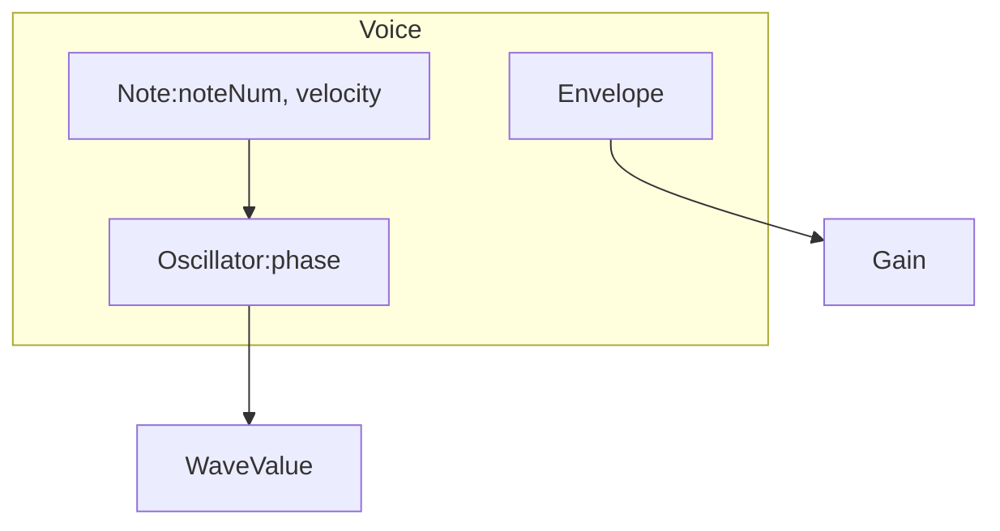
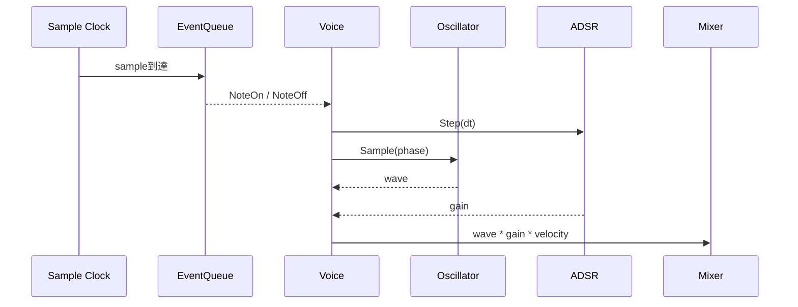

# シンセアーキテクチャ

## 全体設計

- MIDI を時間付きイベント列に変換した上で、sample 単位で音声信号を生成する
- **Parser：**MIDI(SMF)を解釈し、tick ベースの Note / Tempo / Control Change を抽出する。音声処理, 時間進行は行わない。
- **Sequencer：**tick 単位のイベントを、テンポ情報を考慮して sample 単位のイベント列に変換する。ここで「実時間」が確定する（Note / CC を含む）。
- **SynthEngine：**sample を最小時間単位として進行し、イベントに応じて Voice を生成, 更新しながら各 sample の音圧値を計算する
- **ChannelConfig：**チャンネル別の SynthMode/波形/ADSR/音量/FMパラメータを保持し、NoteOn時に Voice へコピーする
- **AudioBuffer：**sample 単位で生成された音声信号を保持する。ここではファイル形式や量子化方式に依存しない純粋な波形データ
- **Writer：**AudioBuffer を WAV に書き出す
- **SynthMode：**発音経路の切り替え（Basic / FM）。WaveTypeとは別のレイヤで選択する

## SynthEngine内部設計

- MIDI 由来のイベントをキューとして受け取り、それに応じて Voice を生成, 更新し、各 sample の音声値を Mixer で合成する
- **SampleLoop：**音声生成における時間の最小単位。
1sample(Loop) = 1 / fs 秒 として進行し、ここで起きる全処理は同一時刻上の出来事として扱う
- **Queue：**Sequencer が生成した NoteOn, Off / Control Change イベント列
指示情報として、該当 sample 到達時点で消費する
- **Voices：**発音中の全 Voice を保持する集合。
- **Voice：**Oscillator, Envelope を内部に持ち、時間経過と共に状態が更新される（SynthModeに応じた内部状態を含む）
- **ChannelConfig：**チャンネル別のプリセット（SynthMode/波形/ADSR/音量/FMパラメータ）。NoteOn時の初期値として使用する
- **Mixer：**全 Voice が生成した音声値を加算し、その sample における最終的な音圧値を決定する(実装変更の可能性アリ)

## Voices内部設計

- **Note：**MIDI イベントに由来するパラメータ情報。音高と強度を保持する
- **Oscillator：**位相を状態として保持し、現在の位相から瞬間的な波形値を生成する
- **FM：**キャリア/モジュレータの位相とパラメータを持ち、FMサンプル値を生成する
- **Envelope：**時間をもとに、パラメータの変化量を出力する

## 1サンプル生成の流れ

