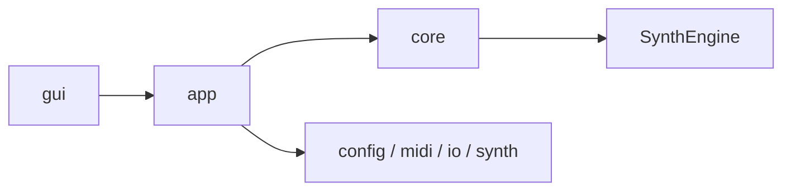

# Architecture

最終更新: 2026-03-04

このファイルはアーキテクチャの正本。
詳細は `docs/architecture/` 配下を参照する。

## Layer View

## Documents

上から順に読むことを推奨する。

| Doc | 役割 |
|---|---|
| `docs/architecture/HANDBOOK.md` | 全体方針、原則、更新ルール |
| `docs/architecture/README.md` | 全体像と読み順 |
| `docs/architecture/module-map.md` | モジュール責務と依存方向 |
| `docs/architecture/runtime-flow.md` | 実行時データフロー（CLI/GUI共通） |
| `docs/architecture/gui.md` | GUI構成（`src/gui` 集約 + main/pianoroll責務分割） |
| `docs/architecture/config-and-io.md` | Config読込分割と I/O 方針 |

## Notes

- 依存方向の原則は `gui -> app -> core`（`core` は `gui` 非依存）
- `ConfigLoad` は `src/config/load/` へ分割済み
- GUI実装は `src/gui/` 配下に集約し、`GUIMain.cpp` と `GUIPianoRoll.cpp` を中心に責務分割している

## Auto-Generated

<!-- AUTO-GENERATED:BEGIN -->
### Auto Snapshot

- Generated by `scripts/check.ps1`
- Generated at: 2026-03-08 07:05:36

### Core Files

- `src/SoundGenerate.cpp` (updated: 2026-03-05 01:13:48)
- `src/app/RunDefaults.cpp` (updated: 2026-03-05 02:01:14)
- `src/app/RunExecution.cpp` (updated: 2026-03-05 02:01:10)
- `src/app/RunSave.cpp` (updated: 2026-03-05 01:12:02)
- `src/app/RunStats.cpp` (updated: 2026-03-05 01:12:02)
- `src/midi/MIDIParser.cpp` (updated: 2026-03-05 01:18:41)
- `src/midi/Sequencer.cpp` (updated: 2026-03-05 02:00:59)
- `src/midi/MIDIPipeline.cpp` (updated: 2026-03-05 02:01:06)
- `src/core/RenderGateway.cpp` (updated: 2026-02-21 18:10:08)
- `src/SynthEngine/Engine.cpp` (updated: 2026-02-21 18:44:31)
- `src/SynthEngine/Events.cpp` (updated: 2026-03-05 01:18:41)
- `src/SynthEngine/Renderer.cpp` (updated: 2026-02-23 22:11:53)
- `src/SynthEngine/Voices.cpp` (updated: 2026-03-05 01:18:41)
- `src/io/Writer.cpp` (updated: 2026-03-05 01:12:02)
- `include/SynthEngine/SynthEngine.h` (updated: 2026-03-05 02:11:27)
<!-- AUTO-GENERATED:END -->

