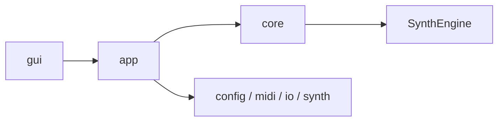

# Architecture

最終更新: 2026-03-03

このファイルはアーキテクチャの正本。
詳細は `docs/architecture/` 配下を参照する。

## Layer View

## Documents

上から順に読むことを推奨する。

| Doc | 役割 |
|---|---|
| `docs/architecture/HANDBOOK.md` | 全体方針、原則、更新ルール |
| `docs/architecture/README.md` | 全体像と読み順 |
| `docs/architecture/module-map.md` | モジュール責務と依存方向 |
| `docs/architecture/runtime-flow.md` | 実行時データフロー（CLI/GUI共通） |
| `docs/architecture/gui.md` | GUI構成（main/pianoroll分割後） |
| `docs/architecture/config-and-io.md` | Config読込分割と I/O 方針 |

## Notes

- 依存方向の原則は `gui -> app -> core`（`core` は `gui` 非依存）
- `ConfigLoad` は `src/config/load/` へ分割済み
- GUI本体は `src/gui/main/`、ピアノロールは `src/gui/pianoroll/` へ分割済み

## Auto-Generated

<!-- AUTO-GENERATED:BEGIN -->
### Auto Snapshot

- Generated by `scripts/check.ps1`
- Generated at: 2026-03-03 03:24:43

### Core Files

- `src/SoundGenerate.cpp` (updated: 2026-02-21 17:21:51)
- `src/app/RunDefaults.cpp` (updated: 2026-02-21 17:55:25)
- `src/app/RunExecution.cpp` (updated: 2026-02-21 19:33:26)
- `src/app/RunSave.cpp` (updated: 2026-02-23 22:11:53)
- `src/app/RunStats.cpp` (updated: 2026-02-21 18:18:17)
- `src/midi/MIDIParser.cpp` (updated: 2026-03-03 03:20:36)
- `src/midi/Sequencer.cpp` (updated: 2026-03-03 03:19:59)
- `src/midi/MidiPipeline.cpp` (updated: 2026-03-03 03:20:05)
- `src/core/RenderGateway.cpp` (updated: 2026-02-21 18:10:08)
- `src/SynthEngine/Engine.cpp` (updated: 2026-02-21 18:44:31)
- `src/SynthEngine/Events.cpp` (updated: 2026-03-03 03:22:33)
- `src/SynthEngine/Renderer.cpp` (updated: 2026-02-23 22:11:53)
- `src/SynthEngine/Voices.cpp` (updated: 2026-03-03 03:22:42)
- `src/io/Writer.cpp` (updated: 2026-02-23 22:11:53)
- `include/SynthEngine/SynthEngine.h` (updated: 2026-03-03 03:19:37)
<!-- AUTO-GENERATED:END -->
