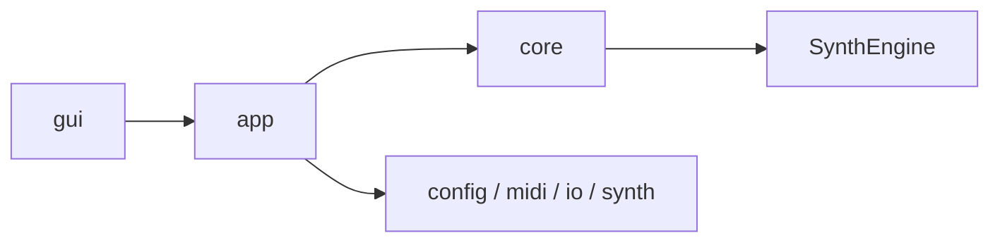

# Architecture

最終更新: 2026-03-08

このファイルはアーキテクチャの正本。
詳細は `docs/architecture/` 配下を参照する。

## Layer View

## Module Summary

- GUI: `src/gui`, `include/gui`
- APP: `src/app`, `include/app`
- CORE: `src/core`, `include/core`
- ENGINE: `src/SynthEngine`, `include/SynthEngine`
- CONFIG/IO: `src/config`, `include/config`, `src/io`, `include/io`
- MIDI: `src/midi`, `include/midi`

## Notes

- 依存方向の原則は `gui -> app -> core`（`core` は `gui` 非依存）
- `ConfigLoad` は `src/config/load/` へ分割済み
- GUI実装は `src/gui/` 配下に集約し、`GUIMain.cpp` と `GUIPianoRoll.cpp` を中心に責務分割している
- Source契約（capability/lifecycle/schema）の正本は `docs/synth-methods/foundation-contract.md`
- 設計判断（ADR）は `docs/DECISIONS.md` を正本として運用する
- パラメータ仕様の正本は `docs/architecture/`（特に `gui.md` / `module-map.md`）と `docs/synth-methods/foundation-contract.md` とする
- `docs/SOUND_PARAMETERS.md` は参照導線のみ保持し、仕様の詳細は持たない

## Auto-Generated

<!-- AUTO-GENERATED:BEGIN -->
### Auto Snapshot

- Generated by `scripts/check.ps1`
- Generated at: 2026-03-19 04:07:10

### Core Files

- `src/SoundGenerate.cpp` (updated: 2026-03-05 01:13:48)
- `src/app/RunDefaults.cpp` (updated: 2026-03-05 02:01:14)
- `src/app/RunExecution.cpp` (updated: 2026-03-05 02:01:10)
- `src/app/RunSave.cpp` (updated: 2026-03-05 01:12:02)
- `src/app/RunStats.cpp` (updated: 2026-03-05 01:12:02)
- `src/midi/MIDIParser.cpp` (updated: 2026-03-05 01:18:41)
- `src/midi/Sequencer.cpp` (updated: 2026-03-05 02:00:59)
- `src/midi/MIDIPipeline.cpp` (updated: 2026-03-05 02:01:06)
- `src/core/RenderGateway.cpp` (updated: 2026-02-21 18:10:08)
- `src/SynthEngine/Engine.cpp` (updated: 2026-02-21 18:44:31)
- `src/SynthEngine/Events.cpp` (updated: 2026-03-19 02:49:15)
- `src/SynthEngine/Renderer.cpp` (updated: 2026-03-19 04:05:55)
- `src/SynthEngine/Voices.cpp` (updated: 2026-03-19 04:05:32)
- `src/io/Writer.cpp` (updated: 2026-03-05 01:12:02)
- `include/SynthEngine/SynthEngine.h` (updated: 2026-03-19 04:04:22)
<!-- AUTO-GENERATED:END -->

