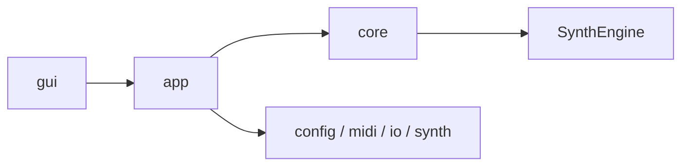

# Architecture

髫ｴ蟠｢ﾂ€鬩搾ｽｨ郢ｧ莠･・ｳ・ｩ髫ｴ繝ｻ・ｽ・ｰ: 2026-02-23

驍ｵ・ｺ髦ｮ蜷ｶ繝ｻ驛｢譎・ｽｼ譁撰ｼ憺Δ・ｧ繝ｻ・､驛｢譎｢・ｽ・ｫ驍ｵ・ｺ繝ｻ・ｯ驛｢・ｧ繝ｻ・｢驛｢譎｢・ｽ・ｼ驛｢・ｧ繝ｻ・ｭ驛｢譏ｴ繝ｻ邵ｺ驢搾ｽｹ譏ｶ繝ｻ・取・・ｸ・ｺ繝ｻ・ｮ髯ｷ闌ｨ・ｽ・･髯ｷ・ｿ繝ｻ・｣驍ｵ・ｺ繝ｻ・ｧ驍ｵ・ｺ陷ｷ・ｶ・つ€郢晢ｽｻ鬮ｫ遨ゑｽｹ證ｦ・ｽ・ｨ繝ｻ・｡髫ｲ・｡繝ｻ・｡髯樊ｻゑｽｽ・ｧ驍ｵ・ｺ繝ｻ・ｫ髯昴・・ｽ・ｾ髯滂ｽ｢隲帛ｲｩ繝ｻ驛｢・ｧ闕ｵ譏ｶ陞ｺ驛｢・ｧ遶丞仰€遶擾ｽｬ繝ｻ・ｩ繝ｻ・ｳ鬩肴得・ｽ・ｰ驍ｵ・ｺ繝ｻ・ｯ `docs/architecture/` 鬯ｩ貅ｷ・ｰ・ｺ繝ｻ・ｸ闕ｵ譏ｶ繝ｻ髯具ｽｻ郢晢ｽｻ霑夲ｽ｡驍ｵ・ｺ陷会ｽｱ遶擾ｽｪ驍ｵ・ｺ陷会ｽｱ隨ｳ繝ｻ・ｸ・ｲ郢晢ｽｻ
## Layer View

## Documents

髣包ｽｳ驗呻ｽｫ・ゑｽｰ驛｢・ｧ髯具ｽｾ繝ｻ・ｰ郢晢ｽｻ遶企ｦｴ蝮｡繝ｻ・ｭ驛｢・ｧ・つ€驍ｵ・ｺ髦ｮ蜷ｮ繝ｻ驛｢・ｧ陷ｻ驛・€・ｳ髯槭ｑ・ｽ・ｨ驍ｵ・ｺ陷ｷ・ｶ繝ｻ迢暦ｽｸ・ｲ郢晢ｽｻ
| Doc | 髯溷私・ｽ・ｹ髯ｷ謇假ｽｽ・ｲ |
|---|---|
| `docs/architecture/HANDBOOK.md` | 髯ｷ闌ｨ・ｽ・ｨ髣厄ｽｴ隰撰ｽｺ陝€・ｿ鬯ｩ・･隴擾ｽｴ・つ€遶乗刋・ｬ・｡髯ｷ莉｣繝ｻ・つ€遶擾ｽｵ陝ｲ・ｩ髫ｴ繝ｻ・ｽ・ｰ驛｢譎｢・ｽ・ｫ驛｢譎｢・ｽ・ｼ驛｢譎｢・ｽ・ｫ |
| `docs/architecture/README.md` | 髯ｷ闌ｨ・ｽ・ｨ髣厄ｽｴ霓｣蛟･ﾎ｡驍ｵ・ｺ繝ｻ・ｨ鬮ｫ・ｱ繝ｻ・ｭ驍ｵ・ｺ繝ｻ・ｿ鬯ｯ繝ｻ繝ｻ|
| `docs/architecture/module-map.md` | 驛｢譎｢・ｽ・｢驛｢・ｧ繝ｻ・ｸ驛｢譎｢・ｽ・･驛｢譎｢・ｽ・ｼ驛｢譎｢・ｽ・ｫ鬮ｮ蜈ｷ・ｽ・ｬ髯ｷ讎顔函遶雁ｮ壼ｵｩ隴取得・ｽ・ｭ闖ｫ・ｶ陝€・ｿ髯ｷ・ｷ郢晢ｽｻ|
| `docs/architecture/runtime-flow.md` | 髯橸ｽｳ雋・ｽｯ繝ｻ・｡隴ｴ・ｧ陷・ｽｾ驛｢譏ｴ繝ｻ郢晢ｽｻ驛｢・ｧ繝ｻ・ｿ驛｢譎・ｽｼ驥・ｺｽ・ｹ譎｢・ｽ・ｼ郢晢ｽｻ郢晢ｽｻLI/GUI髯ｷ闌ｨ・ｽ・ｱ鬯ｨ・ｾ陞滂ｽｲ繝ｻ・ｼ郢晢ｽｻ|
| `docs/architecture/gui.md` | GUI髫ｶ雋樒私郢晢ｽｻ郢晢ｽｻ郢晢ｽｻain/pianoroll髯具ｽｻ郢晢ｽｻ霑夲ｽ｡髯滓坩・ｯ莨夲ｽｽ・ｼ郢晢ｽｻ|
| `docs/architecture/config-and-io.md` | Config鬮ｫ・ｱ繝ｻ・ｭ鬮ｴ雜｣・ｽ・ｼ髯具ｽｻ郢晢ｽｻ霑夲ｽ｡驍ｵ・ｺ繝ｻ・ｨ I/O 髫ｴ繝ｻ・ｽ・ｹ鬯ｩ・･郢晢ｽｻ|

## Notes

- 髣懈瑳蜑後・・ｭ闖ｫ・ｶ陝€・ｿ髯ｷ・ｷ闔会ｽ｣郢晢ｽｻ髯ｷ・ｴ雋・ｽｷ隰・ｴ驍ｵ・ｺ繝ｻ・ｯ `gui -> app -> core`郢晢ｽｻ郢晢ｽｻcore` 驍ｵ・ｺ繝ｻ・ｯ `gui` 鬯ｮ・ｱ隶楢ｲｻ・ｽ・ｾ隴取得・ｽ・ｭ陋帙・・ｽ・ｼ郢晢ｽｻ- `ConfigLoad` 驍ｵ・ｺ繝ｻ・ｯ `src/config/load/` 驍ｵ・ｺ繝ｻ・ｸ髯具ｽｻ郢晢ｽｻ霑夲ｽ｡髮九ｇ迴ｾ遶擾ｽｩ
- GUI髫ｴ蟷｢・ｽ・ｬ髣厄ｽｴ髦ｮ蜷ｶ繝ｻ `src/gui/main/`驍ｵ・ｲ遶丞｣ｹﾎｧ驛｢・ｧ繝ｻ・｢驛｢譎擾ｽｼ・ｱ・取ｺｽ・ｹ譎｢・ｽ・ｼ驛｢譎｢・ｽ・ｫ驍ｵ・ｺ繝ｻ・ｯ `src/gui/pianoroll/` 驍ｵ・ｺ繝ｻ・ｸ髯具ｽｻ郢晢ｽｻ霑夲ｽ｡髮九ｇ迴ｾ遶擾ｽｩ

## Auto-Generated

<!-- AUTO-GENERATED:BEGIN -->
### Auto Snapshot

- Generated by `scripts/check.ps1`
- Generated at: 2026-02-26 17:36:16

### Core Files

- `src/SoundGenerate.cpp` (updated: 2026-02-21 17:21:51)
- `src/app/RunDefaults.cpp` (updated: 2026-02-21 17:55:25)
- `src/app/RunExecution.cpp` (updated: 2026-02-21 19:33:26)
- `src/app/RunSave.cpp` (updated: 2026-02-23 22:11:53)
- `src/app/RunStats.cpp` (updated: 2026-02-21 18:18:17)
- `src/midi/MIDIParser.cpp` (updated: 2026-02-23 22:11:53)
- `src/midi/Sequencer.cpp` (updated: 2026-02-23 22:11:53)
- `src/midi/MidiPipeline.cpp` (updated: 2026-02-22 01:21:05)
- `src/core/RenderGateway.cpp` (updated: 2026-02-21 18:10:08)
- `src/SynthEngine/Engine.cpp` (updated: 2026-02-21 18:44:31)
- `src/SynthEngine/Events.cpp` (updated: 2026-02-21 18:09:42)
- `src/SynthEngine/Renderer.cpp` (updated: 2026-02-23 22:11:53)
- `src/SynthEngine/Voices.cpp` (updated: 2026-02-23 22:11:53)
- `src/io/Writer.cpp` (updated: 2026-02-23 22:11:53)
- `include/SynthEngine/SynthEngine.h` (updated: 2026-02-26 17:14:52)
<!-- AUTO-GENERATED:END -->

