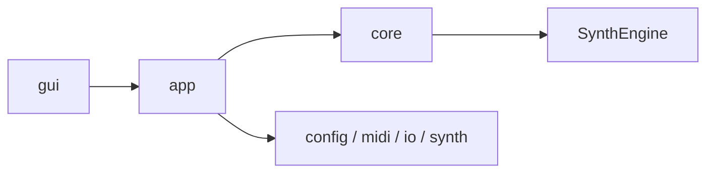

# Architecture

譛€邨よ峩譁ｰ: 2026-02-23

縺薙・繝輔ぃ繧､繝ｫ縺ｯ繧｢繝ｼ繧ｭ繝・け繝√Ε縺ｮ蜈･蜿｣縺ｧ縺吶€・隕乗ｨ｡諡｡螟ｧ縺ｫ蟇ｾ蠢懊☆繧九◆繧√€∬ｩｳ邏ｰ縺ｯ `docs/architecture/` 驟堺ｸ九↓蛻・牡縺励∪縺励◆縲・
## Layer View

## Documents

荳翫°繧蛾・↓隱ｭ繧€縺薙→繧呈耳螂ｨ縺吶ｋ縲・
| Doc | 蠖ｹ蜑ｲ |
|---|---|
| `docs/architecture/HANDBOOK.md` | 蜈ｨ菴捺婿驥昴€∝次蜑・€∵峩譁ｰ繝ｫ繝ｼ繝ｫ |
| `docs/architecture/README.md` | 蜈ｨ菴灘ワ縺ｨ隱ｭ縺ｿ鬆・|
| `docs/architecture/module-map.md` | 繝｢繧ｸ繝･繝ｼ繝ｫ雋ｬ蜍吶→萓晏ｭ俶婿蜷・|
| `docs/architecture/runtime-flow.md` | 螳溯｡梧凾繝・・繧ｿ繝輔Ο繝ｼ・・LI/GUI蜈ｱ騾夲ｼ・|
| `docs/architecture/gui.md` | GUI讒区・・・ain/pianoroll蛻・牡蠕鯉ｼ・|
| `docs/architecture/config-and-io.md` | Config隱ｭ霎ｼ蛻・牡縺ｨ I/O 譁ｹ驥・|

## Notes

- 萓晏ｭ俶婿蜷代・蜴溷援縺ｯ `gui -> app -> core`・・core` 縺ｯ `gui` 髱樔ｾ晏ｭ假ｼ・- `ConfigLoad` 縺ｯ `src/config/load/` 縺ｸ蛻・牡貂医∩
- GUI譛ｬ菴薙・ `src/gui/main/`縲√ヴ繧｢繝弱Ο繝ｼ繝ｫ縺ｯ `src/gui/pianoroll/` 縺ｸ蛻・牡貂医∩

## Auto-Generated

<!-- AUTO-GENERATED:BEGIN -->
### Auto Snapshot

- Generated by `scripts/check.ps1`
- Generated at: 2026-02-26 16:16:42

### Core Files

- `src/SoundGenerate.cpp` (updated: 2026-02-21 17:21:51)
- `src/app/RunDefaults.cpp` (updated: 2026-02-21 17:55:25)
- `src/app/RunExecution.cpp` (updated: 2026-02-21 19:33:26)
- `src/app/RunSave.cpp` (updated: 2026-02-23 22:11:53)
- `src/app/RunStats.cpp` (updated: 2026-02-21 18:18:17)
- `src/midi/MIDIParser.cpp` (updated: 2026-02-23 22:11:53)
- `src/midi/Sequencer.cpp` (updated: 2026-02-23 22:11:53)
- `src/midi/MidiPipeline.cpp` (updated: 2026-02-22 01:21:05)
- `src/core/RenderGateway.cpp` (updated: 2026-02-21 18:10:08)
- `src/SynthEngine/Engine.cpp` (updated: 2026-02-21 18:44:31)
- `src/SynthEngine/Events.cpp` (updated: 2026-02-21 18:09:42)
- `src/SynthEngine/Renderer.cpp` (updated: 2026-02-23 22:11:53)
- `src/SynthEngine/Voices.cpp` (updated: 2026-02-23 22:11:53)
- `src/io/Writer.cpp` (updated: 2026-02-23 22:11:53)
- `include/SynthEngine/SynthEngine.h` (updated: 2026-02-23 22:11:53)
<!-- AUTO-GENERATED:END -->

