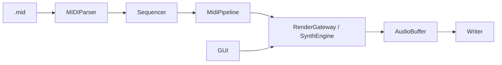

# 繧ｷ繝ｳ繧ｻ繧｢繝ｼ繧ｭ繝・け繝√Ε

譛€邨よ峩譁ｰ: 2026-02-21  
蟇ｾ雎｡: 迴ｾ陦・`main`・・UI Sound/Music 蛻・屬 + 繝斐い繝弱Ο繝ｼ繝ｫ逶ｴ謗･謫堺ｽ懷ｮ溯｣・ｾ鯉ｼ・
## 蜈ｨ菴捺ｧ矩€

## 繝ｬ繧､繝､縺ｨ雋ｬ蜍・
- `gui`: UI謠冗判縲；UI迥ｶ諷九€￣review蜀咲函縲√Θ繝ｼ繧ｶ繝ｼ謫堺ｽ・- `app`: 螳溯｡後Δ繝ｼ繝蛾∈謚橸ｼ・UI/CLI・峨€∬ｵｷ蜍輔ヵ繝ｭ繝ｼ縲ヽun蜻ｼ縺ｳ蜃ｺ縺怜宛蠕｡
- `core`: 繧ｵ繝ｳ繝励Ν逕滓・譛ｬ菴難ｼ・ynthEngine・・- `midi`: MIDI繝代・繧ｹ縲》ick/sample螟画鋤縲√う繝吶Φ繝亥・讒狗ｯ・- `config`: 險ｭ螳夊ｪｭ霎ｼ/菫晏ｭ倥€｝reset隗｣豎ｺ縲∵､懆ｨｼ
- `io`: WAV菫晏ｭ倥€√ヱ繧ｹ/譁・ｭ励さ繝ｼ繝牙､画鋤縲！/O險ｺ譁ｭ

萓晏ｭ俶婿蜷・
- `gui -> app -> core`
- `app -> config/midi/io`
- `core` 縺ｯ `gui` 髱樔ｾ晏ｭ・
## 螳溯｣・ｸｻ隕√ヵ繧｡繧､繝ｫ

- `src/GUIMain.cpp`: GUI繝ｫ繝ｼ繝茨ｼ・op/Body/Logs縲ヾound/Music蛻・崛・・- `src/gui/GUIPianoRoll.cpp`: 繝斐い繝弱Ο繝ｼ繝ｫ謠冗判/逶ｴ謗･邱ｨ髮・繧ｷ繝ｧ繝ｼ繝医き繝・ヨ
- `src/gui/GUIActions.cpp`: Run髢句ｧ・蛛懈ｭ｢縲￣review髢｢騾｣繧｢繧ｯ繧ｷ繝ｧ繝ｳ
- `src/gui/PreviewAudio.cpp`: miniaudio繝吶・繧ｹ縺ｮPreview蜀咲函
- `src/app/Cli.cpp`, `src/app/AppEntry.cpp`: CLI蜈･蜿｣
- `src/app/RunExecution.cpp`: Run譛ｬ菴難ｼ・IDI -> Render -> Save・・- `src/midi/MIDIParser.cpp`, `src/midi/Sequencer.cpp`: MIDI蜃ｦ逅・- `src/midi/MidiPipeline.cpp`: MIDI隱ｭ霎ｼ・枹ample繧､繝吶Φ繝亥喧
- `src/core/RenderGateway.cpp`: app/core 蠅・阜
- `src/SynthEngine/*.cpp`: 蜷域・繝帙ャ繝医ヱ繧ｹ
- `src/io/PlatformPaths.cpp`: UTF/path陬懷勧

## GUI讒区・・育樟陦鯉ｼ・
- 繝倥ャ繝€陦・
  - 蟾ｦ: `Sound` / `Music` 繧ｿ繝・  - 蜿ｳ: `Status` + `UI Scale`
- 謫堺ｽ懆｡・
  - `Sound`: `Play Preview (Selected ch)` / `Loop Preview` / `Stop`
  - `Music`: `Export WAV` / `Play Preview (Display ch)` / `Loop Preview` / `Stop`
- 繝倥Ν繝・
  - 繝帙ヰ繝ｼ蟇ｾ雎｡縺ｫ蠢懊§縺・陦後・繝ｫ繝苓｡ｨ遉ｺ
- 繝ｭ繧ｰ:
  - 謚倥ｊ縺溘◆縺ｿ蠑上€∽ｸ区ｮｵ蝗ｺ螳壹€√ラ繝ｩ繝・げ縺ｧ鬮倥＆螟画峩

## 繝斐い繝弱Ο繝ｼ繝ｫ・育樟陦御ｻ墓ｧ假ｼ・
鬮倬ｻ蠎ｦ謫堺ｽ・
- 蟾ｦ繧ｯ繝ｪ繝・け: 驕ｸ謚・- 繝峨Λ繝・げ: 遘ｻ蜍・- 繝弱・繝育ｫｯ繝峨Λ繝・げ: 髟ｷ縺募､画峩
- 遨ｺ逋ｽ繝峨Λ繝・げ: 霑ｽ蜉
- `Shift + 遨ｺ逋ｽ繝峨Λ繝・げ`: 遽・峇驕ｸ謚・- `Ctrl+Z` / `Ctrl+Y`: Undo/Redo

繝翫ン繧ｲ繝ｼ繧ｷ繝ｧ繝ｳ:
- 繝帙う繝ｼ繝ｫ: 邵ｦ繧ｹ繧ｯ繝ｭ繝ｼ繝ｫ
- `Shift + 繝帙う繝ｼ繝ｫ`: 讓ｪ繧ｹ繧ｯ繝ｭ繝ｼ繝ｫ
- `Ctrl + 繝帙う繝ｼ繝ｫ`: 譎る俣繧ｺ繝ｼ繝・医・繧ｦ繧ｹ菴咲ｽｮ荳ｭ蠢・ｼ・
蜀咲函/Snap:
- 繝ｫ繝ｼ繝ｩ繧ｯ繝ｪ繝・け: Preview髢句ｧ逆ick螟画峩
- `Space`: Preview蜀咲函/蛛懈ｭ｢
- `Q`: Snap ON/OFF
- `1/2/3/4`: 1/4, 1/8, 1/16, 1/32

陦ｨ遉ｺ譛€驕ｩ蛹・
- 繝ｭ繧ｰ髢矩哩繧・え繧｣繝ｳ繝峨え鬮倥＆縺ｫ霑ｽ蠕薙＠縺ｦ陦ｨ遉ｺ陦梧焚繧定・蜍戊ｪｿ謨ｴ
- 繝ｫ繝ｼ繝ｩ蛻礼分蜿ｷ縺ｯ譛€蟆剰｡ｨ遉ｺ髢馴囈繧帝←逕ｨ・域焚蟄励▽縺ｶ繧碁亟豁｢・・
## 繝・・繧ｿ蠅・阜

- 蜈ｬ髢帰PI: `include/AppCore.h`
  - `Run(const AppConfig&)`
  - `Run(const AppConfig&, const RenderOptions&, IRunObserver*)`
- GUI迥ｶ諷区ｰｸ邯壼喧:
  - `config/gui_state.json`
  - 螟画鋤/菫晏ｭ・ `src/gui/GUIStatePersistence.cpp`, `src/gui/GUIStateStorage.cpp`
- 繝斐い繝弱Ο繝ｼ繝ｫ邱ｨ髮・憾諷・
  - `gui::PianoRollState`
  - 逶ｴ謗･邱ｨ髮・・MIDI蜴滓悽繧剃ｸ頑嶌縺阪○縺壹€；UI蛛ｴ邱ｨ髮・憾諷九→縺励※菫晄戟

## 繝峨く繝･繝｡繝ｳ繝医・豁｣

- 騾ｲ謐・ `docs/STATUS.md`
- 螳溯｡・驕狗畑: `README.md`・・F-Synthesizer/README.md`・・- 繝斐い繝弱Ο繝ｼ繝ｫ蛻ｩ逕ｨ閠・髄縺・ `docs/USER_PIANO_ROLL_GUIDE.md`
- 繝斐い繝弱Ο繝ｼ繝ｫ謫堺ｽ懊Μ繝輔ぃ繝ｬ繝ｳ繧ｹ: `docs/PIANO_ROLL_CONTROLS.md`
- 遘ｻ陦悟ｱ･豁ｴ・亥㍾邨撰ｼ・ `docs/archive/`

## Waveform Phase A Notes (2026-02-23)

- `WaveformConfig` now has `quality` (`legacy` / `bandLimited`).
- Render path for `source.type=waveform` passes `phaseInc` and `quality` into oscillator sampling.
- `saw` and `square` use polyBLEP-based band-limited generation when `quality=bandLimited`.
- Config JSON for waveform source supports:
  - `"wave": "sine|square|saw|triangle"`
  - `"quality": "legacy|bandLimited"`

## Auto-Generated

<!-- AUTO-GENERATED:BEGIN -->
### Auto Snapshot

- Generated by `scripts/check.ps1`
- Generated at: 2026-02-23 22:37:15

### Core Files

- `src/SoundGenerate.cpp` (updated: 2026-02-21 17:21:51)
- `src/app/RunDefaults.cpp` (updated: 2026-02-21 17:55:25)
- `src/app/RunExecution.cpp` (updated: 2026-02-21 19:33:26)
- `src/app/RunSave.cpp` (updated: 2026-02-23 22:11:53)
- `src/app/RunStats.cpp` (updated: 2026-02-21 18:18:17)
- `src/midi/MIDIParser.cpp` (updated: 2026-02-23 22:11:53)
- `src/midi/Sequencer.cpp` (updated: 2026-02-23 22:11:53)
- `src/midi/MidiPipeline.cpp` (updated: 2026-02-22 01:21:05)
- `src/core/RenderGateway.cpp` (updated: 2026-02-21 18:10:08)
- `src/SynthEngine/Engine.cpp` (updated: 2026-02-21 18:44:31)
- `src/SynthEngine/Events.cpp` (updated: 2026-02-21 18:09:42)
- `src/SynthEngine/Renderer.cpp` (updated: 2026-02-23 22:11:53)
- `src/SynthEngine/Voices.cpp` (updated: 2026-02-23 22:11:53)
- `include/SynthEngine/SynthEngine.h` (updated: 2026-02-23 22:11:53)
<!-- AUTO-GENERATED:END -->

