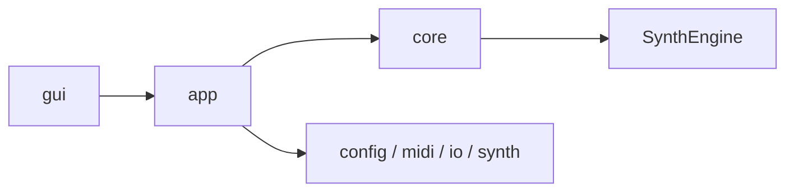

# Architecture

隴崢€驍ｨ繧亥ｳｩ隴・ｽｰ: 2026-02-23

邵ｺ阮吶・郢晁ｼ斐＜郢ｧ・､郢晢ｽｫ邵ｺ・ｯ郢ｧ・｢郢晢ｽｼ郢ｧ・ｭ郢昴・縺醍ｹ昶・ﾎ慕ｸｺ・ｮ陷茨ｽ･陷ｿ・｣邵ｺ・ｧ邵ｺ蜷ｶﾂ€繝ｻ髫穂ｹ暦ｽｨ・｡隲｡・｡陞滂ｽｧ邵ｺ・ｫ陝・ｽｾ陟｢諛岩・郢ｧ荵昶螺郢ｧ竏堋€竏ｬ・ｩ・ｳ驍擾ｽｰ邵ｺ・ｯ `docs/architecture/` 鬩溷ｺ・ｸ荵昶・陋ｻ繝ｻ迚｡邵ｺ蜉ｱ竏ｪ邵ｺ蜉ｱ笳・ｸｲ繝ｻ
## Layer View

## Documents

闕ｳ鄙ｫﾂｰ郢ｧ陋ｾ・ｰ繝ｻ竊馴坡・ｭ郢ｧﾂ€邵ｺ阮吮・郢ｧ蜻郁€ｳ陞ゑｽｨ邵ｺ蜷ｶ・狗ｸｲ繝ｻ
| Doc | 陟厄ｽｹ陷托ｽｲ |
|---|---|
| `docs/architecture/HANDBOOK.md` | 陷茨ｽｨ闖ｴ謐ｺ蟀ｿ鬩･譏ｴﾂ€竏晄ｬ｡陷代・ﾂ€竏ｵ蟲ｩ隴・ｽｰ郢晢ｽｫ郢晢ｽｼ郢晢ｽｫ |
| `docs/architecture/README.md` | 陷茨ｽｨ闖ｴ轣倥Ρ邵ｺ・ｨ髫ｱ・ｭ邵ｺ・ｿ鬯・・|
| `docs/architecture/module-map.md` | 郢晢ｽ｢郢ｧ・ｸ郢晢ｽ･郢晢ｽｼ郢晢ｽｫ髮具ｽｬ陷榊生竊定嵩譎擾ｽｭ菫ｶ蟀ｿ陷ｷ繝ｻ|
| `docs/architecture/runtime-flow.md` | 陞ｳ貅ｯ・｡譴ｧ蜃ｾ郢昴・繝ｻ郢ｧ・ｿ郢晁ｼ釆溽ｹ晢ｽｼ繝ｻ繝ｻLI/GUI陷茨ｽｱ鬨ｾ螟ｲ・ｼ繝ｻ|
| `docs/architecture/gui.md` | GUI隶貞玄繝ｻ繝ｻ繝ｻain/pianoroll陋ｻ繝ｻ迚｡陟暮ｯ会ｽｼ繝ｻ|
| `docs/architecture/config-and-io.md` | Config髫ｱ・ｭ髴趣ｽｼ陋ｻ繝ｻ迚｡邵ｺ・ｨ I/O 隴・ｽｹ鬩･繝ｻ|

## Notes

- 關捺剌・ｭ菫ｶ蟀ｿ陷ｷ莉｣繝ｻ陷ｴ貅ｷ謠ｴ邵ｺ・ｯ `gui -> app -> core`繝ｻ繝ｻcore` 邵ｺ・ｯ `gui` 鬮ｱ讓費ｽｾ譎擾ｽｭ蛛・ｽｼ繝ｻ- `ConfigLoad` 邵ｺ・ｯ `src/config/load/` 邵ｺ・ｸ陋ｻ繝ｻ迚｡雋ょ現竏ｩ
- GUI隴幢ｽｬ闖ｴ阮吶・ `src/gui/main/`邵ｲ竏壹Χ郢ｧ・｢郢晏ｼｱﾎ溽ｹ晢ｽｼ郢晢ｽｫ邵ｺ・ｯ `src/gui/pianoroll/` 邵ｺ・ｸ陋ｻ繝ｻ迚｡雋ょ現竏ｩ

## Auto-Generated

<!-- AUTO-GENERATED:BEGIN -->
### Auto Snapshot

- Generated by `scripts/check.ps1`
- Generated at: 2026-02-26 17:26:14

### Core Files

- `src/SoundGenerate.cpp` (updated: 2026-02-21 17:21:51)
- `src/app/RunDefaults.cpp` (updated: 2026-02-21 17:55:25)
- `src/app/RunExecution.cpp` (updated: 2026-02-21 19:33:26)
- `src/app/RunSave.cpp` (updated: 2026-02-23 22:11:53)
- `src/app/RunStats.cpp` (updated: 2026-02-21 18:18:17)
- `src/midi/MIDIParser.cpp` (updated: 2026-02-23 22:11:53)
- `src/midi/Sequencer.cpp` (updated: 2026-02-23 22:11:53)
- `src/midi/MidiPipeline.cpp` (updated: 2026-02-22 01:21:05)
- `src/core/RenderGateway.cpp` (updated: 2026-02-21 18:10:08)
- `src/SynthEngine/Engine.cpp` (updated: 2026-02-21 18:44:31)
- `src/SynthEngine/Events.cpp` (updated: 2026-02-21 18:09:42)
- `src/SynthEngine/Renderer.cpp` (updated: 2026-02-23 22:11:53)
- `src/SynthEngine/Voices.cpp` (updated: 2026-02-23 22:11:53)
- `src/io/Writer.cpp` (updated: 2026-02-23 22:11:53)
- `include/SynthEngine/SynthEngine.h` (updated: 2026-02-26 17:14:52)
<!-- AUTO-GENERATED:END -->

