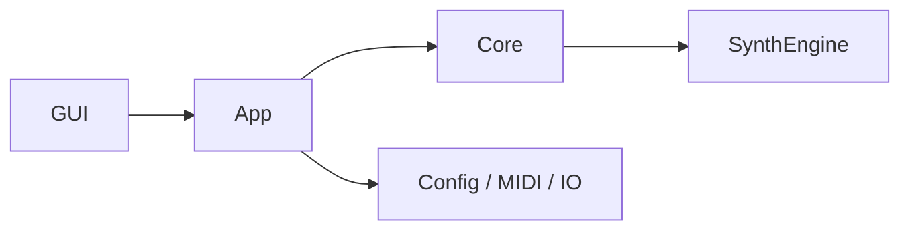

# アーキテクチャ

このファイルを F-Synthesizer のコンパクトなアーキテクチャ正本にします。
開発方針と設計基準は `docs/ArchitectureAssessment.md` に置きます。
Instrument Model、preset 再編、GUI 再設計までの長期改変計画は `docs/LONG_TERM_REFACTOR_PLAN.md` に置きます。

## レイヤー構成

## モジュール

- `src/gui`, `include/gui`: ImGui UI、プレビュー操作、ピアノロール、ステップシーケンサー、ワークスペース状態。
- `src/app`, `include/app`: CLI/GUI 入口、実行既定値、実行処理、保存・統計フロー。
- `src/core`, `include/core`: レンダリングゲートウェイと共有 AudioBuffer 境界。
- `src/SynthEngine`, `include/SynthEngine`: voice、event、renderer、modulation、smoothing、filter、mix/effects。
- `src/config`, `include/config`: JSON load/save、preset merge、source registry、schema validation。
- `src/midi`, `include/midi`: MIDI 読み込み、解析、イベントパイプライン、シーケンス処理。
- `src/io`, `include/io`: WAV 書き出しと platform path helper。
- `src/synth`, `include/synth`: oscillator と envelope helper。

依存方向は `gui -> app -> core -> SynthEngine` を基本にします。Core のレンダリングコードは
GUI 状態に依存しません。

## 守る境界

- GUI は編集、表示、プレビュー操作を担当し、音生成アルゴリズムを直接実装しない。
- App は CLI/GUI からの実行条件を `AppConfig` と `RenderOptions` にそろえる。
- Core は app から SynthEngine への薄い実行境界に保つ。
- SynthEngine は音生成、voice、modulation、filter、mix/effects の実行時処理に集中する。
- Config は JSON load/save、preset merge、schema validation を担当し、GUI と renderer に同じ契約を重複させない。
- Source capability と schema の共通判断は `SourceRegistry` に集約する。

## モデル境界

保存、GUI、実行時レンダリングの境界は、次のモデルで分けます。

- `ProjectModel`: 保存、preset、config の正本。JSON load/save はこのモデルを入出力する。
- `RenderConfig`: SynthEngine へ渡す実行用モデル。GUI や保存形式に依存しない render 入力にする。
- `AppConfig`: CLI/GUI 実行境界。`ProjectModel` から生成し、app 層の実行条件をまとめる。
- GUI Facade: 既存画面コードから `ProjectModel` へアクセスするための中間層。GUI と保存モデルの変換点を集約する。
- `GUIState`: 互換用の集約型。内部は永続状態、画面一時状態、非同期実行状態、ログ状態の base struct に分ける。

## 肥大化リスク

- `include/SynthEngine/SynthEngine.h`: source config、channel config、effect config が集まりやすい公開境界。新規設定を足す前に分割候補を確認する。
- `include/gui/GUIState.h`: 永続状態、画面一時状態、非同期実行状態が集まりやすい。新しい状態を足す前に寿命と保存要否を確認する。
- config load/save/schema: 音源契約の変更が重複しやすい。GUI editor、preset、renderer と同時変更になる場合は設計レビュー対象にする。
- GUI `.inl` 群: 画面単位の追記で巨大化しやすい。音作りロジックや config 契約を含めない。

## 実行フロー

1. CLI または GUI が `AppConfig` を作る。
2. 設定読み込みが `base.json`、任意の preset JSON、明示 config、GUI 編集状態をマージする。
3. MIDI 入力を時間付きの音楽イベントへ解析する。
4. Sequencer が音楽時間を sample 基準の render event へ変換する。
5. `SynthEngine` が source voice をレンダリングし、modulation と common shaping を適用し、channel mix と master effects を処理する。
6. `Writer` が WAV を書き出す。GUI preview も可能な限り同じ実行経路を使う。

## 設定と音源

- プリセットは `config/presets/*.json` に置き、`config/base.json` の上に適用する。
- `config/default.json` は通常のローカル開始点。
- config / preset の保存形式は `format: "projectModel.v2"` と `project` object を持つ。
- `project.channels` は MIDI チャンネルごとの音色設定を表す。
- `source.type` は音源契約を選ぶ。
  - `waveform`: 基本 oscillator、unison、sub oscillator、filter、smoothing、PWM、ring modulation、hard sync、arpeggio。
  - `analog`: waveform 系の減算的音源。drive と drift を持つ。
  - `fm`: algorithm ベースの FM 音源。operator ratio、output level、feedback、modulation しやすい index を持つ。
  - `noise`: white / pink / brown noise と shared filter shaping。
  - `drumkit`: ch10 運用向けの note number map。
- source capability と schema の共通挙動は、GUI や load code へ重複実装せず `SourceRegistry` に集約する。
- 未知の config key は警告にできるが、不正値や未対応 source field は load error にする。

## GUI 契約

- UI は短い編集→試聴サイクルを最優先する。
- 主導線は `Play / Compose / Export / Advanced`。
- `Play` は起動直後の画面で、音楽用途の Sound Card、4 つの感覚的な macro、試聴、簡易キーボードだけを前面に出す。カテゴリは `Lead / Guitar / Bass / Pad / Keys / Drums / SFX / Support` を基本にする。
- `Compose` は MIDI、ピアノロール、ステップシーケンサー、簡易チャンネル割当を扱う。
- `Export` は WAV 書き出しに集中し、形式設定は折りたたみの詳細設定に置く。
- `Advanced` は詳細 source control、Master FX、Mixer/割当、検査用 preset の到達先にする。
- 専門的な音色編集は Play に常時表示せず、Advanced または Play の Inspector 導線から開く。
- Piano-roll 編集と drum step-sequencer 編集は、preview と export の両方へ反映する。
- GUI 状態は `config/gui_state.json` に保存する。Piano-roll project は `config/piano_roll_project.json` に保存する。
- GUI code は sound synthesis を直接実装せず、app/core のレンダリング経路を呼ぶ。

## 音とレンダリング契約

- 音質判断は `docs/PRODUCT_POLICY.md` に従い、継続開発性を落とさない範囲で「気持ちよい音」と短い feedback を優先する。
- 実戦向けの周期波形は、source と補助 layer の両方で不要な aliasing や段差ノイズを増やさない。PSG noise、DrumKit の noise、SFX noise は意図的な音源として扱い、この基準の対象外にする。
- Attack / Bass / Lead / Chord / Pad / Pluck / String / Body / Harmonic / PowerChord / Chug / AmpCab layer は source 本体を置き換えるものではなく、用途が明確な補助音として扱う。Chord はPad背景、Stringは弦/Pad、BodyはPad/Pluckの共鳴、HarmonicはOrgan/Keysの整数倍音補助、PowerChord/Chug/AmpCabはGuitarとロック向けSound Cardの補助に限定して使う。
- source 非依存の modulation と shared shaping は common engine path に置く。
- source 固有の挙動は、その音源方式に本当に必要な場合だけ該当 renderer に置く。
- Master effects は固定順で処理する: sample-rate reducer、bit crusher、chorus、flanger、delay、reverb。
- 既存 preset の音は原則安定させる。ただし音質改善のための明示的な破壊的変更では、全実戦 preset を再調整して検証する。

## ドキュメント方針

このファイルは、以前分割されていた architecture、synth-method、GUI、sound-parameter、status、
decision 系ドキュメントの要点を置き換えます。短く、現在の状態に合わせて保ちます。
履歴の詳細は新しい archive ファイルではなく Git 履歴から参照します。
