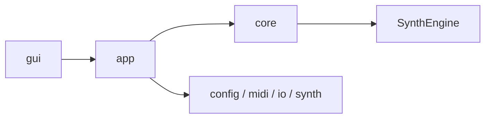

# Architecture Handbook

最終更新: 2026-03-08

## プロジェクト概要

MIDIファイルを読み込み、複数の合成方式（Waveform / FM / Noise / Drum）でシンセサイズし、WAVファイルを出力する Windows 向けソフトウェアシンセサイザー。GUI / CLI 両対応。

## 1. Reader Navigation

| 読みたい内容 | まず読む | 次に読む |
|---|---|---|
| 3分で全体像を把握 | `HANDBOOK.md` 2章 | `module-map.md` |
| 実装変更の安全性を確認 | `module-map.md` | `runtime-flow.md` |
| GUI責務の把握 | `gui.md` | `runtime-flow.md` |
| Configや保存経路の把握 | `config-and-io.md` | `runtime-flow.md` |

## 2. 全体像（1枚図）



## 2.1 技術スタック

| 技術 | 用途 | 選定理由 |
|---|---|---|
| C++20 (MSVC v143) | 実装言語 | リアルタイム音声処理に適した低レベル制御 |
| Dear ImGui | GUI フレームワーク | 即時モード描画で高速プロトタイピング可能 |
| GLFW | ウィンドウ / 入力管理 | ImGui の標準バックエンド |
| OpenGL | 描画バックエンド | ImGui + GLFW の標準組み合わせ |
| miniaudio | 音声再生 | シングルヘッダで導入容易 |
| 標準ライブラリ `<regex>` | JSON 解析 | 外部依存を最小化するため独自パーサーで対応 |

## 2.2 規模

| 指標 | 値 |
|---|---|
| プロジェクトコード | 約 11,700 行（.cpp + .h + .inl） |
| ソースファイル数 | 84（.cpp: 46、.h: 31、.inl: 7） |
| 主要モジュール | 8（gui / app / core / SynthEngine / config / midi / io / synth） |
| 対応合成方式 | 4（Waveform / FM / Noise / Drum） |
| 外部依存 | 3 ライブラリ（ImGui / GLFW / miniaudio） |

## 2.3 Architecture Evidence

| 観点 | 確認方法 | 参照 |
|---|---|---|
| 構造の入口 | 読み順が `README.md` に固定されていることを確認 | `docs/architecture/README.md` |
| GUI責務分割 | `main` と `pianoroll` の分割表を確認 | `docs/architecture/gui.md` |
| Config読込分割 | `Config Load Split` 表で `load/*.cpp` 分割を確認 | `docs/architecture/config-and-io.md` |
| Voiceデータレイアウト | `VoicesSoA` をレンダで使用し、AoSは互換定義として残す方針を確認 | `docs/architecture/module-map.md`, `src/SynthEngine/Internal.h`, `src/SynthEngine/Voices.cpp`, `src/SynthEngine/Renderer.cpp` |
| 設計判断記録 | `Special Notes` に日付付きADRが存在することを確認 | `docs/architecture/module-map.md`, `docs/architecture/runtime-flow.md`, `docs/architecture/gui.md`, `docs/architecture/config-and-io.md` |

## 3. レイヤーと依存ルール

アーキテクチャ原則（確定版）:

1. 依存方向を固定する: `gui -> app -> core`
2. UIとドメインロジックを分離し、相互依存を作らない
3. 設定・入出力は境界層で吸収し、内部ロジックへ漏らさない
4. 実行フロー（CLI/GUI）は共通のアプリケーション経路に統合する
5. 重要な設計判断は `Special Notes` に `背景/判断/代替案/影響範囲/関連ファイル` を記録する

詳細: `docs/architecture/module-map.md`

## 3.1 依存ルール記号

| 記号 | 意味 |
|---|---|
| `OK` | 明示的に許可された依存 |
| `WARN` | 非推奨（原則避ける） |
| `NG` | 禁止（設計破壊） |

## 4. 実行フロー（CLI/GUI）

- CLI/GUIともに `app` 層の共通実行経路を使う
- `RenderOptions` により `Preview` / `Export` を切り替える
- キャンセルは `IRunObserver::ShouldCancel()` を通じて扱う

詳細: `docs/architecture/runtime-flow.md`

## 5. 主要コンポーネント責務

| 領域 | 主責務 | 詳細 |
|---|---|---|
| GUI | 入力・表示・UI状態 | `docs/architecture/gui.md` |
| APP | 実行制御・共通フロー | `docs/architecture/runtime-flow.md` |
| CORE/ENGINE | 合成処理境界と実処理 | `docs/architecture/module-map.md` |
| CONFIG/IO | 設定I/Oと保存境界 | `docs/architecture/config-and-io.md` |

## 6. 設計判断ログ導線（Special Notes）

`Special Notes` は「なぜその実装を採用したか」を残す記録欄。

記録カテゴリ（確定）:

1. GUI操作・状態管理
2. 実行フロー/キャンセル
3. Config互換性
4. MIDI時間変換
5. 音響アルゴリズム上の制約

追記先:

| カテゴリ | 追記先 |
|---|---|
| GUI操作・状態管理 | `docs/architecture/gui.md` |
| 実行フロー/キャンセル | `docs/architecture/runtime-flow.md` |
| Config互換性 | `docs/architecture/config-and-io.md` |
| MIDI時間変換 | `docs/architecture/runtime-flow.md` |
| 音響アルゴリズム上の制約 | `docs/architecture/module-map.md` |

テンプレート:

```md
### YYYY-MM-DD: タイトル
- カテゴリ:
- 背景:
- 判断:
- 代替案:
- 影響範囲:
- 関連ファイル:
```

※ 同一テンプレートは `docs/architecture/README.md` の `ADR Card Template` にも掲載。

## 7. 変更時の更新ルール

1. 依存方向や責務が変わったら `module-map.md` を更新する
2. 実行経路や中断仕様が変わったら `runtime-flow.md` を更新する
3. GUI責務や状態遷移が変わったら `gui.md` を更新する
4. Config schemaや保存方針が変わったら `config-and-io.md` を更新する
5. 特殊対応が発生したら、同日に該当ファイルの `Special Notes` を追記する

## 7.1 Foundation契約（capability / lifecycle / schema）更新規約

1. 正本は `SourceRegistry`（`include/config/SourceRegistry.h`, `src/config/SourceRegistry.cpp`）とする。
2. GUI/app/SynthEngine 側で種別判定を増やす場合は、直書きを避けて `SourceRegistry` の公開API参照へ統一する。
3. 契約変更時は、同日に以下を最小更新する。
   - `config-and-io.md`: 受理条件・互換影響
   - `module-map.md`: 境界責務（どの層が判定責務を持つか）
   - `STATUS.md` / `STATUS_DETAIL.md`: 作業結果
4. 重要な運用判断（採用/非採用、段階導入、凍結）は `DECISIONS.md` に追記する。

## 7.2 Portfolio Readiness Check

| チェック項目 | 合格条件 |
|---|---|
| プロジェクト概要 | 本ファイルの 2.1 と 2.2 に技術スタックと規模表がある |
| 図の整合 | `README.md`, `module-map.md`, `runtime-flow.md`, `gui.md`, `config-and-io.md` に `mermaid` 図がある |
| 設計原則 | `module-map.md` の依存ルールが `gui -> app -> core` を含む |
| 判断記録 | 4ファイル（`module-map.md`, `runtime-flow.md`, `gui.md`, `config-and-io.md`）に日付付き `Special Notes` がある |
| 導線 | `Reader Navigation` と `README.md` の `Read Order` が存在する |
