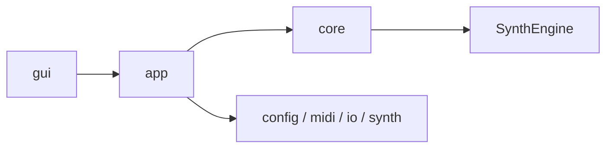

# Architecture Handbook

最終更新: 2026-02-24

## 1. 目的と読者

- 主読者:
  - 将来の自分/チーム
  - エンジニア（実装者）
  - 採用担当（非実装者）
- 主目的:
  - 全体像を短時間で伝える
  - 設計判断の妥当性を示す
- 公開レベル:
  - 原則公開（ポートフォリオ利用を想定）

## 1.1 Reader Navigation

| 読みたい内容 | まず読む | 次に読む |
|---|---|---|
| 3分で全体像を把握 | `HANDBOOK.md` 2章 | `module-map.md` |
| 実装変更の安全性を確認 | `module-map.md` | `runtime-flow.md` |
| GUI責務の把握 | `gui.md` | `runtime-flow.md` |
| Configや保存経路の把握 | `config-and-io.md` | `runtime-flow.md` |

## 2. 全体像（1枚図）



## 2.1 Before / After (Refactor Summary)

| 観点 | Before | After |
|---|---|---|
| 構造の入口 | 単一説明中心 | Handbook + 分割詳細 |
| GUI責務 | 大きな単位に集中 | `main` / `pianoroll` に分割 |
| Config読込 | 単一実装寄り | `load/` で責務分割 |
| 設計判断の保管 | 散在しやすい | `Special Notes` に集約 |

## 3. レイヤーと依存ルール

アーキテクチャ原則（確定版）:

1. 依存方向を固定する: `gui -> app -> core`
2. UIとドメインロジックを分離し、相互依存を作らない
3. 設定・入出力は境界層で吸収し、内部ロジックへ漏らさない
4. 実行フロー（CLI/GUI）は共通のアプリケーション経路に統合する
5. 重要な設計判断は `Special Notes` に記録し、変更理由を追跡可能にする

詳細: `docs/architecture/module-map.md`

## 3.1 Rule Signal

| 記号 | 意味 |
|---|---|
| `OK` | 明示的に許可された依存 |
| `WARN` | 非推奨（原則避ける） |
| `NG` | 禁止（設計破壊） |

## 4. 実行フロー（CLI/GUI）

- CLI/GUIともに `app` 層の共通実行経路を使う
- `RenderOptions` により `Preview` / `Export` を切り替える
- キャンセルは `IRunObserver::ShouldCancel()` を通じて扱う

詳細: `docs/architecture/runtime-flow.md`

## 5. 主要コンポーネント責務

| 領域 | 主責務 | 詳細 |
|---|---|---|
| GUI | 入力・表示・UI状態 | `docs/architecture/gui.md` |
| APP | 実行制御・共通フロー | `docs/architecture/runtime-flow.md` |
| CORE/ENGINE | 合成処理境界と実処理 | `docs/architecture/module-map.md` |
| CONFIG/IO | 設定I/Oと保存境界 | `docs/architecture/config-and-io.md` |

## 6. 設計判断ログ導線（Special Notes）

`Special Notes` は「なぜその実装を採用したか」を残す記録欄。

記録カテゴリ（確定）:

1. GUI操作・状態管理
2. 実行フロー/キャンセル
3. Config互換性
4. MIDI時間変換
5. 音響アルゴリズム上の制約

追記先:

| カテゴリ | 追記先 |
|---|---|
| GUI操作・状態管理 | `docs/architecture/gui.md` |
| 実行フロー/キャンセル | `docs/architecture/runtime-flow.md` |
| Config互換性 | `docs/architecture/config-and-io.md` |
| MIDI時間変換 | `docs/architecture/runtime-flow.md` |
| 音響アルゴリズム上の制約 | `docs/architecture/module-map.md` |

テンプレート:

```md
### YYYY-MM-DD: タイトル
- カテゴリ:
- 背景:
- 判断:
- 代替案:
- 影響範囲:
- 関連ファイル:
```

## 7. 変更時の更新ルール

1. 依存方向や責務が変わったら `module-map.md` を更新する
2. 実行経路や中断仕様が変わったら `runtime-flow.md` を更新する
3. GUI責務や状態遷移が変わったら `gui.md` を更新する
4. Config schemaや保存方針が変わったら `config-and-io.md` を更新する
5. 特殊対応が発生したら、同日に該当ファイルの `Special Notes` を追記する

## 7.1 Portfolio Readiness Check

| チェック項目 | 期待状態 |
|---|---|
| 図の整合 | 主要フロー図が壊れていない |
| 設計原則 | 5原則と実装が矛盾しない |
| 判断記録 | `Special Notes` が実例で更新されている |
| 導線 | 読者別ナビゲーションで迷わない |
