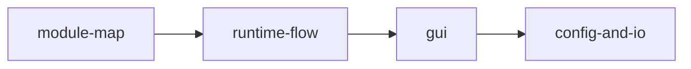

# Architecture Overview

最終更新: 2026-02-23

## Big Picture



## Scope

このディレクトリは、現行実装の構造を以下の観点で分割管理します。

1. モジュール責務と依存方向
2. 実行時データフロー
3. GUI構成
4. Config/I/O 境界

## Read Order

1. `docs/architecture/module-map.md`
2. `docs/architecture/runtime-flow.md`
3. `docs/architecture/gui.md`
4. `docs/architecture/config-and-io.md`

## Quick Map

| ファイル | 主題 | 更新タイミング |
|---|---|---|
| `module-map.md` | レイヤー責務/依存方向 | フォルダ再編・依存変更時 |
| `runtime-flow.md` | 実行経路・境界 | Run経路/RenderOptions変更時 |
| `gui.md` | GUI分割・状態管理 | GUI分割/画面責務変更時 |
| `config-and-io.md` | Config読込/保存・I/O方針 | Config schema/I/O経路変更時 |

## Design Rules

- 依存方向は `gui -> app -> core` を維持する
- `core` は UI 実装（ImGui/GLFW）に依存しない
- Config 解析ロジックは `src/config/load/` に集約する
- GUI巨大化は `src/gui/main/` と `src/gui/pianoroll/` の責務分割で抑制する

## Documentation Operation Rule

- 特殊な設計判断や実装方法を入れたら、その場で該当mdに追記する
- 追記先は次の対応表に従う

| 事象 | 追記先 |
|---|---|
| 依存方向・責務境界の例外 | `module-map.md` |
| 実行順序・キャンセル・性能経路の特殊化 | `runtime-flow.md` |
| GUI操作/状態管理/描画の特殊ロジック | `gui.md` |
| Config schema互換・JSON解釈・保存方針の特殊化 | `config-and-io.md` |

- 追記テンプレート:

```md
## Special Notes

### YYYY-MM-DD: タイトル
- 背景:
- 判断:
- 影響範囲:
- 関連ファイル:
```
