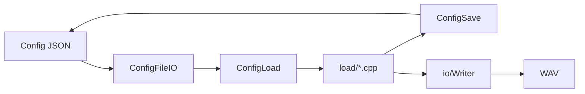

# Config And IO

最終更新: 2026-03-08

## Data Path

## Config Surface

| Surface | Location |
|---|---|
| `LoadConfigFile(...)` | `src/config/ConfigFileIO.cpp` |
| `SaveConfigFile(...)` | `src/config/ConfigFileIO.cpp` |

## Config Load Split

| 区分 | File |
|---|---|
| 入口 | `src/config/ConfigLoad.cpp` |
| Top-level | `src/config/load/LoadTopLevel.cpp` |
| Channel | `src/config/load/LoadChannel.cpp` |
| Source | `src/config/load/LoadSource.cpp` |
| Modulation | `src/config/load/LoadModulation.cpp` |
| 内部宣言 | `src/config/load/Internal.h` |

## Save / JSON Helpers

| File | 役割 |
|---|---|
| `src/config/ConfigSave.cpp` | Configの書き出し |
| `src/config/ConfigJSONUtils.cpp` | JSON補助 |
| `src/config/SourceJSON.cpp` | Source定義のJSON変換 |
| `src/config/SourceRegistry.cpp` | Source種別解決 |

## Path / Writer

| 区分 | File |
|---|---|
| パス解決・UTF補助 | `src/io/PlatformPaths.cpp`, `include/io/PlatformPaths.h` |
| WAV保存 | `src/io/Writer.cpp`, `include/io/Writer.h` |

## Config/IO実装確認ポイント

| 観点 | 確認点 | 参照 |
|---|---|---|
| 読込責務 | 入口 `ConfigLoad.cpp` から `load/*.cpp` へ分割される | `src/config/ConfigLoad.cpp`, `src/config/load/` |
| 保存導線 | Config保存は `ConfigSave.cpp`、WAV保存は `io/Writer.cpp` が担当する | `src/config/ConfigSave.cpp`, `src/io/Writer.cpp` |
| パス境界 | パス/UTF処理は `PlatformPaths` 経由で行う | `src/io/PlatformPaths.cpp`, `include/io/PlatformPaths.h` |

## Compatibility Matrix

| 変更種別 | 互換ポリシー | 追記先 |
|---|---|---|
| キー追加 | 後方互換維持 | `config-and-io.md` Special Notes |
| キー廃止 | 移行方針を明示 | `config-and-io.md` Special Notes |
| デフォルト変更 | 影響範囲を明示 | `runtime-flow.md` 併記 |
| foundation 契約変更（capability/lifecycle/schema） | 正本 `foundation-contract.md` を更新し、本書は差分要約のみ追記 | `docs/synth-methods/foundation-contract.md`, `config-and-io.md` |

変更影響の確認先は `docs/architecture/README.md` の `Impact Map（変更時の影響先）` を参照。

## Operational Policy

- ランタイム/生成物は Git追跡しない
  - `build/`, `output/`, `result/`, `x64/`, `imgui.ini`, `build/*.i`
- 追跡方針はルート `.gitignore` で管理

## Special Notes

### Config互換性

#### 2026-02-25: 設定ファイルの相対パスは「設定ファイル配置ディレクトリ基準」で解決
- カテゴリ: Config互換性
- 背景: 実行ディレクトリ基準だと、ショートカット起動やGUI起動元の違いで同一configでも参照先が変わる。
- 判断: `LoadConfigFileInternal` で `configPath.parent_path()` を基準に解決する。
- 代替案: 常に `current_path()` 基準で解決する案。
- 影響範囲: config配布時の再現性向上。起動場所依存のパス不具合を抑制。
- 関連ファイル: `src/config/ConfigLoad.cpp`, `src/config/ConfigFileIO.cpp`

#### 2026-02-25: GUI状態保存はフラットキーJSONを維持
- カテゴリ: Config互換性
- 背景: GUI状態読込はregexベースで実装されており、入れ子構造へ変更すると既存読込ロジックと互換が崩れる。
- 判断: `SaveGUIStateStorageFile` は入れ子を使わないキー構造で保存し、読込実装と対にする。
- 代替案: 汎用JSONパーサ導入と同時にスキーマを全面改訂する案。
- 影響範囲: 既存GUI状態ファイルとの互換を維持しつつ、実装複雑度を抑制。
- 関連ファイル: `src/gui/GUIStateStorage.cpp`, `src/config/ConfigJSONUtils.cpp`

ADR記法は `docs/architecture/README.md` の `ADR Card Template` を使用。

#### 2026-03-04: 実行時設定の解決優先順位を `ConfigResolver` に集約
- カテゴリ: Config互換性
- 背景: 設定解決の優先順が呼び出し側へ分散すると、CLI/GUIで異なる設定が選ばれ再現性が崩れる。
- 判断: `ResolveRuntimeConfig` に `--config` / `--preset` / `default.json` / `base+fallback preset` の優先順を固定実装する。
- 代替案: 起動経路ごとに設定解決を個別実装する案。
- 影響範囲: 起動方法に依存しない同一挙動を維持しやすくなり、外部ユーザー向けの運用説明が単純化される。
- 関連ファイル: include/config/ConfigResolver.h, include/config/SourceJSON.h, include/config/SourceRegistry.h, src/config/ConfigFileIO.cpp, src/config/ConfigResolver.cpp

### Config Compatibility

#### 2026-03-05: WAV書き出し失敗を診断可能な契約で返す
- Category: Config Compatibility
- Background: `false` だけ返す失敗契約では、運用時に原因切り分けが難しく復旧導線が作りにくい。
- Decision: `WAVWriteError` に `code/path/errno/systemError/cause/hint` を持たせ、open失敗とwrite失敗を識別して返す。
- Alternatives: ログ出力のみで詳細を返さない案。
- Impact: GUI/CLIで同一の失敗理由表示と案内が可能になり、サポート時の再現確認と復旧手順提示が容易になる。
- Related Files: include/io/Writer.h, src/io/Writer.cpp

#### 2026-03-05: `defaultWave` の設定キーを廃止し、Config上位契約を整理
- Category: Config Compatibility
- Background: `defaultWave` は runtime/gui-cleanup 後に実行経路で未使用になっており、Config にキーだけ残すと「保存されるが効かない」状態を招く。
- Decision: `ConfigSave` の書き出しと `LoadTopLevel` の読込から `defaultWave` を削除し、上位キー契約を実装使用項目に一致させる。
- Alternatives: 廃止予定キーとして no-op 受理を継続し、移行期間を設ける案。
- Impact: 設定契約が単純化され、運用時の誤解（反映されると思って編集する）を防げる。一方で旧キー依存の手元設定は効果を失うため、文書側での周知が必要。
- Related Files: src/config/ConfigSave.cpp, src/config/load/LoadTopLevel.cpp

#### 2026-03-08: `SourceRegistry` に capability / lifecycle / schema 契約を集約
- Category: Config Compatibility
- Background: Source種別ごとの能力・lifecycle・parameter検証が複数箇所へ分散すると、方式追加時にConfig受理条件と実装挙動の差分が発生しやすい。
- Decision: `SourceRegistry` を正本として `SourceCapability` / `SourceLifecyclePolicy` / `ParameterSchema` を集約し、Config検証は同定義を参照する。
- Alternatives: 呼び出し側（Load/GUI/実行層）で種別分岐と検証条件を個別維持する案。
- Impact: 種別追加や契約変更時の更新点が集約され、Config互換の説明責任を一元化できる。ドキュメントと実装の同期も取りやすくなる。
- Related Files: include/config/SourceRegistry.h, src/config/SourceRegistry.cpp

