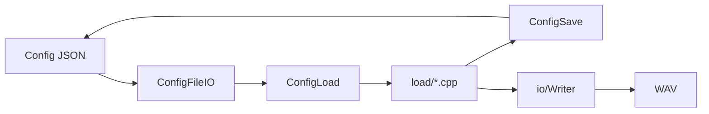

# Config And IO

最終更新: 2026-02-23

## Data Path

## Config Surface

| Surface | Location |
|---|---|
| `LoadConfigFile(...)` | `src/config/ConfigFileIO.cpp` |
| `SaveConfigFile(...)` | `src/config/ConfigFileIO.cpp` |

## Config Load Split

| 区分 | File |
|---|---|
| 入口 | `src/config/ConfigLoad.cpp` |
| Top-level | `src/config/load/LoadTopLevel.cpp` |
| Channel | `src/config/load/LoadChannel.cpp` |
| Source | `src/config/load/LoadSource.cpp` |
| Modulation | `src/config/load/LoadModulation.cpp` |
| 内部宣言 | `src/config/load/Internal.h` |

## Save / JSON Helpers

- `src/config/ConfigSave.cpp`
- `src/config/ConfigJsonUtils.cpp`
- `src/config/SourceJson.cpp`
- `src/config/SourceRegistry.cpp`

## Path / Writer

- パス解決・UTF補助:
  - `src/io/PlatformPaths.cpp`
  - `include/io/PlatformPaths.h`
- WAV保存:
  - `src/io/Writer.cpp`
  - `include/io/Writer.h`

## Operational Policy

- ランタイム/生成物は Git追跡しない
  - `build/`, `output/`, `result/`, `x64/`, `imgui.ini`, `build/*.i`
- 追跡方針はルート `.gitignore` で管理

## Special Notes

この節に、Config互換性・変換ルール・I/O例外処理の特殊対応を追記する。
