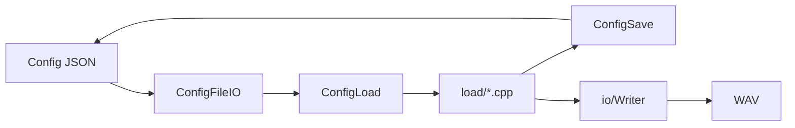
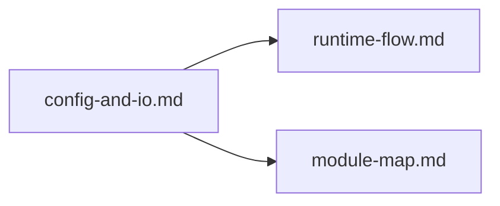

# Config And IO

最終更新: 2026-02-24

## Data Path

## Config Surface

| Surface | Location |
|---|---|
| `LoadConfigFile(...)` | `src/config/ConfigFileIO.cpp` |
| `SaveConfigFile(...)` | `src/config/ConfigFileIO.cpp` |

## Config Load Split

| 区分 | File |
|---|---|
| 入口 | `src/config/ConfigLoad.cpp` |
| Top-level | `src/config/load/LoadTopLevel.cpp` |
| Channel | `src/config/load/LoadChannel.cpp` |
| Source | `src/config/load/LoadSource.cpp` |
| Modulation | `src/config/load/LoadModulation.cpp` |
| 内部宣言 | `src/config/load/Internal.h` |

## Save / JSON Helpers

| File | 役割 |
|---|---|
| `src/config/ConfigSave.cpp` | Configの書き出し |
| `src/config/ConfigJsonUtils.cpp` | JSON補助 |
| `src/config/SourceJson.cpp` | Source定義のJSON変換 |
| `src/config/SourceRegistry.cpp` | Source種別解決 |

## Path / Writer

| 区分 | File |
|---|---|
| パス解決・UTF補助 | `src/io/PlatformPaths.cpp`, `include/io/PlatformPaths.h` |
| WAV保存 | `src/io/Writer.cpp`, `include/io/Writer.h` |

## Before / After (Config/IO)

| 観点 | Before | After |
|---|---|---|
| 読込責務 | 1箇所に集中 | `load/*.cpp` で責務分割 |
| 保存導線 | 説明が散らばりやすい | SurfaceとHelperで明示 |
| I/O境界 | 実装追跡に時間がかかる | Path/Writer表で即追跡可能 |

## Compatibility Matrix

| 変更種別 | 互換ポリシー | 追記先 |
|---|---|---|
| キー追加 | 後方互換維持 | `config-and-io.md` Special Notes |
| キー廃止 | 移行方針を明示 | `config-and-io.md` Special Notes |
| デフォルト変更 | 影響範囲を明示 | `runtime-flow.md` 併記 |

## Impact Map (When This Changes)

## Operational Policy

- ランタイム/生成物は Git追跡しない
  - `build/`, `output/`, `result/`, `x64/`, `imgui.ini`, `build/*.i`
- 追跡方針はルート `.gitignore` で管理

## Special Notes

### Config互換性

- 現在、特記すべき互換性例外なし。

### ADR Card (Template)

| 項目 | 内容 |
|---|---|
| 背景 | |
| 判断 | |
| 代替案 | |
| 採用理由 | |
| 影響範囲 | |
| 関連ファイル | |
