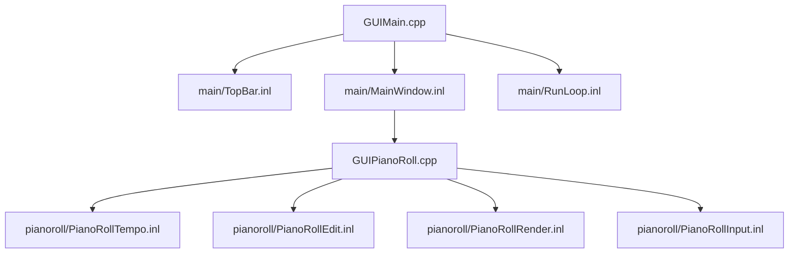
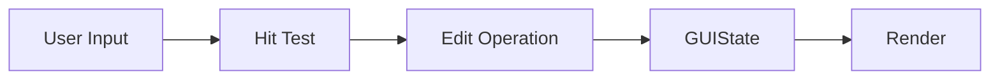

# GUI Architecture

最終更新: 2026-02-25

## Structure

## UI Interaction Map

## Main Split

| File | Role |
|---|---|
| `src/gui/main/TopBar.inl` | フォント初期化、UI倍率、Status表示 |
| `src/gui/main/MainWindow.inl` | メインUI描画、保存導線、エラー導線、ログ表示 |
| `src/gui/main/RunLoop.inl` | ウィンドウ初期化、ImGuiフレームループ、終了処理 |

## Piano Roll Split

| File | Role |
|---|---|
| `src/gui/GUIPianoRoll.cpp` | `DrawPianoRollPanel` のエントリ |
| `src/gui/pianoroll/PianoRollTempo.inl` | tick/sec変換、Snap補助 |
| `src/gui/pianoroll/PianoRollEdit.inl` | ノート編集、Undo/Redo、選択、モデル同期 |
| `src/gui/pianoroll/PianoRollRender.inl` | グリッド/ノート描画 |
| `src/gui/pianoroll/PianoRollInput.inl` | ヒットテスト、ドラッグ更新 |

## GUI State

| 区分 | File |
|---|---|
| 定義 | `include/gui/GUIState.h` |
| 永続化 | `src/gui/GUIStateStorage.cpp`, `src/gui/GUIStatePersistence.cpp` |
| 補助 | `src/gui/GUIActions.cpp`, `src/gui/GUIRunHelpers.cpp`, `src/gui/GUIConfigUtils.cpp` |

## GUI実装確認ポイント

| 観点 | 確認点 | 参照 |
|---|---|---|
| 画面責務 | メイン画面は `main/*.inl`、ピアノロールは `pianoroll/*.inl` に分割される | `src/gui/main/`, `src/gui/pianoroll/` |
| 状態保持 | 状態定義は `GUIState.h`、永続化は `GUIStateStorage/Persistence` が担当する | `include/gui/GUIState.h`, `src/gui/GUIStateStorage.cpp`, `src/gui/GUIStatePersistence.cpp` |
| 編集履歴 | Undo/Redoは `PianoRollEdit.inl` で管理し、上限は `maxUndoCommands` で制御する | `src/gui/pianoroll/PianoRollEdit.inl`, `include/gui/GUIPianoRoll.h` |

変更影響の確認先は `docs/architecture/README.md` の `Impact Map（変更時の影響先）` を参照。

## Special Notes

### GUI操作・状態管理

#### 2026-02-25: Preview再生コールバックはロックなしで進行し、PCM差し替え時のみ排他
- カテゴリ: GUI操作・状態管理
- 背景: オーディオコールバック内でロック待ちが発生すると、再生途切れの原因になる。
- 判断: コールバックでは `frameCursor`/`playing` をatomicで扱い、`PlayPreviewAudio` 側でPCM書換時のみmutexを使用。
- 代替案: 常時mutex保護して整合性を優先する案。
- 影響範囲: 低遅延再生時の安定性向上。実装はatomic状態管理を前提に複雑化。
- 関連ファイル: `src/gui/PreviewAudio.cpp`, `include/gui/PreviewAudio.h`

#### 2026-02-25: Piano Roll Undo履歴を64件に上限化
- カテゴリ: GUI操作・状態管理
- 背景: ノート編集履歴を無制限に保持すると、長時間編集でメモリ使用量が増え続ける。
- 判断: `maxUndoCommands = 64` を既定値として、超過時は最古履歴を破棄。
- 代替案: 無制限保持または差分圧縮方式の履歴管理。
- 影響範囲: メモリ増加を抑制。極端に長い操作列では古いUndoが失われる。
- 関連ファイル: `include/gui/GUIPianoRoll.h`, `src/gui/pianoroll/PianoRollEdit.inl`

ADR記法は `docs/architecture/README.md` の `ADR Card Template` を使用。

#### 2026-02-26: TODO (auto-generated)
- カテゴリ: GUI操作・状態管理
- 背景:
- 判断:
- 代替案:
- 影響範囲:
- 関連ファイル: src/gui/GUIChannelEditor.cpp

#### 2026-03-03: TODO (auto-generated)
- カテゴリ: GUI操作・状態管理
- 背景:
- 判断:
- 代替案:
- 影響範囲:
- 関連ファイル: src/gui/GUIActions.cpp, src/gui/GUIChannelEditor.cpp, src/gui/main/MainWindow.inl

#### 2026-03-04: TODO (auto-generated)
- カテゴリ: GUI操作・状態管理
- 背景:
- 判断:
- 代替案:
- 影響範囲:
- 関連ファイル: include/gui/GUIActions.h, include/gui/GUIRunHelpers.h, include/gui/GUIStatePersistence.h, include/gui/GUIStateStorage.h, src/gui/GUIActions.cpp

#### 2026-03-05: TODO (auto-generated)
- カテゴリ: GUI操作・状態管理
- 背景:
- 判断:
- 代替案:
- 影響範囲:
- 関連ファイル: src/gui/main/MainWindow.inl

