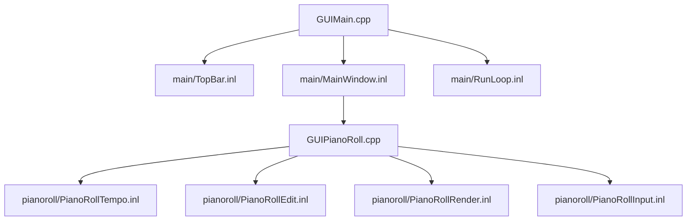
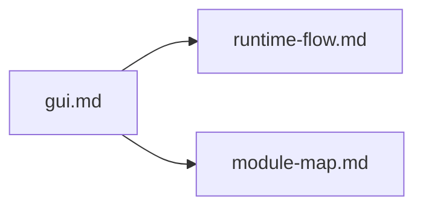

# GUI Architecture

最終更新: 2026-02-24

## Structure

## UI Interaction Map

## Main Split

| File | Role |
|---|---|
| `src/gui/main/TopBar.inl` | フォント初期化、UI倍率、Status表示 |
| `src/gui/main/MainWindow.inl` | メインUI描画、保存導線、エラー導線、ログ表示 |
| `src/gui/main/RunLoop.inl` | ウィンドウ初期化、ImGuiフレームループ、終了処理 |

## Piano Roll Split

| File | Role |
|---|---|
| `src/gui/GUIPianoRoll.cpp` | `DrawPianoRollPanel` のエントリ |
| `src/gui/pianoroll/PianoRollTempo.inl` | tick/sec変換、Snap補助 |
| `src/gui/pianoroll/PianoRollEdit.inl` | ノート編集、Undo/Redo、選択、モデル同期 |
| `src/gui/pianoroll/PianoRollRender.inl` | グリッド/ノート描画 |
| `src/gui/pianoroll/PianoRollInput.inl` | ヒットテスト、ドラッグ更新 |

## GUI State

| 区分 | File |
|---|---|
| 定義 | `include/gui/GUIState.h` |
| 永続化 | `src/gui/GUIStateStorage.cpp`, `src/gui/GUIStatePersistence.cpp` |
| 補助 | `src/gui/GUIActions.cpp`, `src/gui/GUIRunHelpers.cpp`, `src/gui/GUIConfigUtils.cpp` |

## Before / After (GUI)

| 観点 | Before | After |
|---|---|---|
| 画面責務 | 大きめの単位に集中 | `main` と `pianoroll` で責務分離 |
| 追跡性 | 関連コードが点在しやすい | 機能単位で参照が明確 |
| 説明性 | 文章中心 | 構造図 + 役割表で把握可能 |

## Impact Map (When This Changes)

## Special Notes

### GUI操作・状態管理

- 現在、特記すべき例外なし（操作体系変更時に追記）。

### ADR Card (Template)

| 項目 | 内容 |
|---|---|
| 背景 | |
| 判断 | |
| 代替案 | |
| 採用理由 | |
| 影響範囲 | |
| 関連ファイル | |
