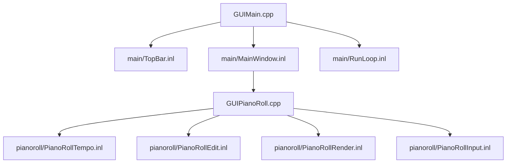

# GUI Architecture

最終更新: 2026-02-23

## Structure

## Entry

- `src/gui/GUIMain.cpp`
  - GUIの統合エントリ
  - `main/*.inl` を取り込み、RunGUIApp を構成

## Main Split

| File | Role |
|---|---|
| `src/gui/main/TopBar.inl` | フォント初期化、UI倍率、Status表示 |
| `src/gui/main/MainWindow.inl` | メインUI描画、保存導線、エラー導線、ログ表示 |
| `src/gui/main/RunLoop.inl` | ウィンドウ初期化、ImGuiフレームループ、終了処理 |

## Piano Roll Split

| File | Role |
|---|---|
| `src/gui/GUIPianoRoll.cpp` | `DrawPianoRollPanel` のエントリ |
| `src/gui/pianoroll/PianoRollTempo.inl` | tick/sec変換、Snap補助 |
| `src/gui/pianoroll/PianoRollEdit.inl` | ノート編集、Undo/Redo、選択、モデル同期 |
| `src/gui/pianoroll/PianoRollRender.inl` | グリッド/ノート描画 |
| `src/gui/pianoroll/PianoRollInput.inl` | ヒットテスト、ドラッグ更新 |

## GUI State

- 定義: `include/gui/GUIState.h`
- 永続化:
  - `src/gui/GUIStateStorage.cpp`
  - `src/gui/GUIStatePersistence.cpp`
- 補助:
  - `src/gui/GUIActions.cpp`
  - `src/gui/GUIRunHelpers.cpp`
  - `src/gui/GUIConfigUtils.cpp`

## Special Notes

この節に、GUI操作体系・状態遷移・描画最適化の特殊対応を追記する。
