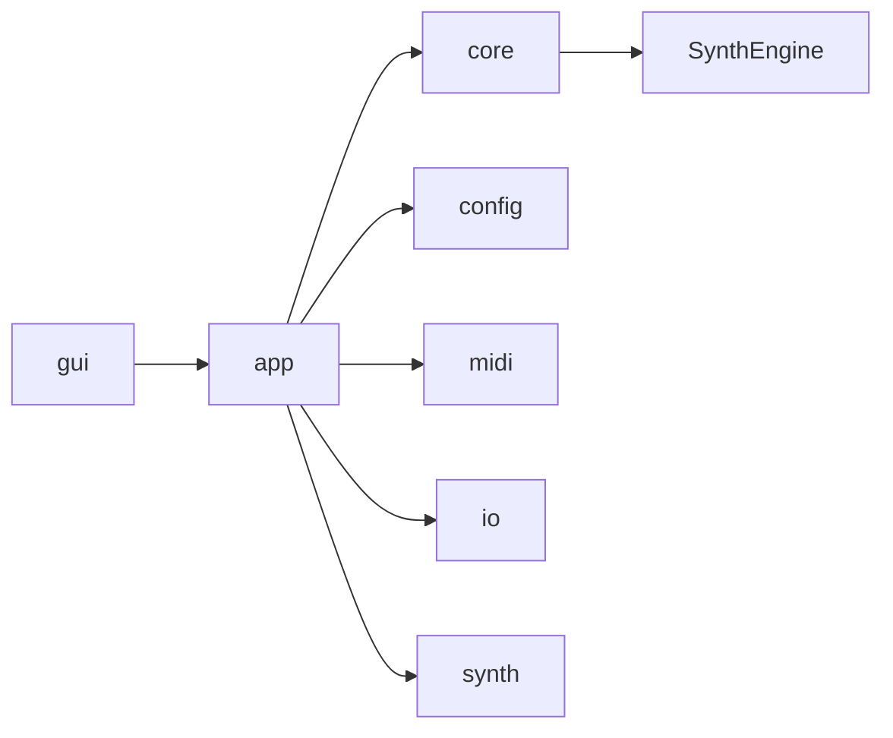
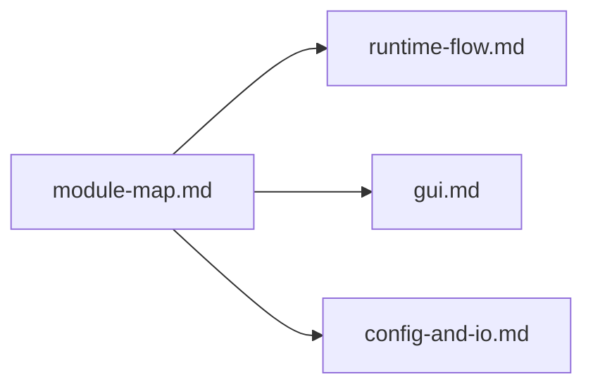

# Module Map

最終更新: 2026-02-24

## Dependency Graph

## Layer Cards

| Layer | Path | Responsibility |
|---|---|---|
| GUI | `src/gui`, `include/gui` | UI描画、UI状態、GUI操作フロー |
| APP | `src/app`, `include/app` | 実行入口、Run制御、CLI/GUI共通実行フロー |
| CORE | `src/core`, `include/core` | appからSynthEngineへの境界 |
| ENGINE | `src/SynthEngine`, `include/SynthEngine` | 合成処理の本体 |
| MIDI | `src/midi`, `include/midi` | MIDI読込、tick/sample変換、pipeline |
| CONFIG | `src/config`, `include/config` | 設定I/O、source registry、resolver |
| IO | `src/io`, `include/io` | パス変換、WAV保存 |
| SYNTH HELPERS | `src/synth`, `include/synth` | 波形・エンベロープなど合成補助 |

## Dependency Rule Signal

| Signal | ルール | 例 |
|---|---|---|
| `OK` | 許可 | `gui -> app`, `app -> core`, `core -> SynthEngine` |
| `WARN` | 非推奨 | `core -> gui` |
| `NG` | 禁止 | `SynthEngine -> gui` |

## Before / After (Structure)

| 観点 | Before | After |
|---|---|---|
| GUI責務 | エントリ側に集中 | `main/` と `pianoroll/` へ分散 |
| Config読込 | 単一大きめ実装 | `load/*.cpp` に機能分割 |
| I/O境界 | パス・保存が散在しやすい | `io/` で明確化 |

## Impact Map (When This Changes)

## Special Notes

### 依存方向・責務境界

- 現在、特記すべき例外なし。

#### 2026-02-24: TODO (auto-generated)
- カテゴリ: 依存方向・責務境界
- 背景:
- 判断:
- 代替案:
- 影響範囲:
- 関連ファイル: include/SynthEngine/Smoothing.h, src/SynthEngine/Modulation.cpp, src/SynthEngine/Smoothing.cpp

### 音響アルゴリズム上の制約

- 現在、特記すべき制約整理なし（必要時は `docs/synth-methods/` 参照と合わせて記録）。

#### 2026-02-24: TODO (auto-generated)
- カテゴリ: 音響アルゴリズム上の制約
- 背景:
- 判断:
- 代替案:
- 影響範囲:
- 関連ファイル: include/SynthEngine/Smoothing.h, src/SynthEngine/Modulation.cpp, src/SynthEngine/Smoothing.cpp

### ADR Card (Template)

| 項目 | 内容 |
|---|---|
| 背景 | |
| 判断 | |
| 代替案 | |
| 採用理由 | |
| 影響範囲 | |
| 関連ファイル | |
