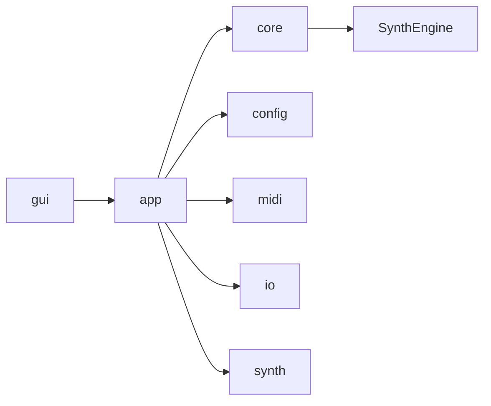

# Module Map

最終更新: 2026-02-23

## Dependency Graph

## Layers

| Layer | Path | Responsibility |
|---|---|---|
| GUI | `src/gui`, `include/gui` | UI描画、UI状態、GUI操作フロー |
| APP | `src/app`, `include/app` | 実行入口、Run制御、CLI/GUI共通実行フロー |
| CORE | `src/core`, `include/core` | appからSynthEngineへの境界 |
| ENGINE | `src/SynthEngine`, `include/SynthEngine` | 合成処理の本体 |
| MIDI | `src/midi`, `include/midi` | MIDI読込、tick/sample変換、pipeline |
| CONFIG | `src/config`, `include/config` | 設定I/O、source registry、resolver |
| IO | `src/io`, `include/io` | パス変換、WAV保存 |
| SYNTH HELPERS | `src/synth`, `include/synth` | 波形・エンベロープなど合成補助 |

## Dependency Direction

| 区分 | ルール |
|---|---|
| 許可 | `gui -> app`, `app -> core`, `app -> config/midi/io/synth`, `core -> SynthEngine` |
| 非推奨 | `core -> gui`, `SynthEngine -> gui` |

## Notable Splits (Recent)

- `ConfigLoad` 分割:
  - `src/config/load/LoadTopLevel.cpp`
  - `src/config/load/LoadChannel.cpp`
  - `src/config/load/LoadSource.cpp`
  - `src/config/load/LoadModulation.cpp`
- `GUIMain` 分割:
  - `src/gui/main/TopBar.inl`
  - `src/gui/main/MainWindow.inl`
  - `src/gui/main/RunLoop.inl`
- `GUIPianoRoll` 分割:
  - `src/gui/pianoroll/PianoRollTempo.inl`
  - `src/gui/pianoroll/PianoRollEdit.inl`
  - `src/gui/pianoroll/PianoRollRender.inl`
  - `src/gui/pianoroll/PianoRollInput.inl`

## Special Notes

この節に、依存境界の例外や一時的な実装上の折衷を追記する。
