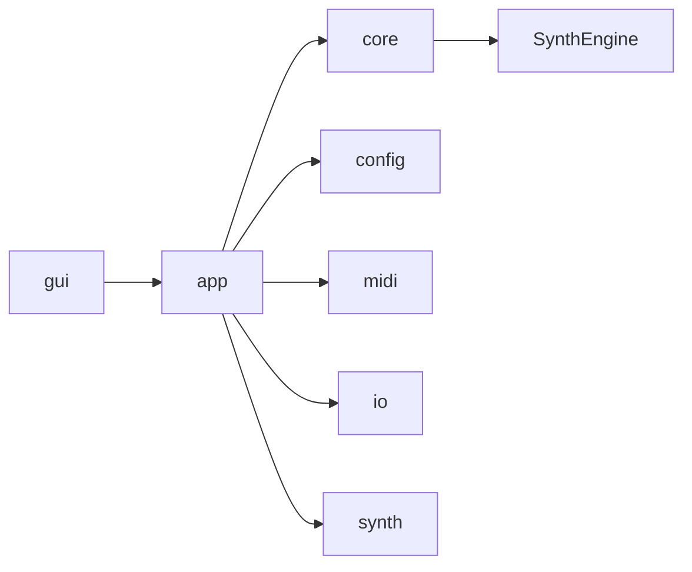

# Module Map

最終更新: 2026-02-25

## Dependency Graph

## Layer Cards

| Layer | Path | Responsibility |
|---|---|---|
| GUI | `src/gui`, `include/gui` | UI描画、UI状態、GUI操作フロー |
| APP | `src/app`, `include/app` | 実行入口、Run制御、CLI/GUI共通実行フロー |
| CORE | `src/core`, `include/core` | appからSynthEngineへの境界 |
| ENGINE | `src/SynthEngine`, `include/SynthEngine` | 合成処理の本体 |
| MIDI | `src/midi`, `include/midi` | MIDI読込、tick/sample変換、pipeline |
| CONFIG | `src/config`, `include/config` | 設定I/O、source registry、resolver |
| IO | `src/io`, `include/io` | パス変換、WAV保存 |
| SYNTH HELPERS | `src/synth`, `include/synth` | 波形・エンベロープなど合成補助 |

## 依存ルール記号

| Signal | ルール | 例 |
|---|---|---|
| `OK` | 許可 | `gui -> app`, `app -> core`, `core -> SynthEngine` |
| `WARN` | 非推奨 | `core -> gui` |
| `NG` | 禁止 | `SynthEngine -> gui` |

## 構造の実装確認ポイント

| 観点 | 確認点 | 参照 |
|---|---|---|
| GUI層 | GUIコードは `src/gui`, `include/gui` に配置される | `src/gui`, `include/gui` |
| 実行層 | 実行制御は `src/app`, `include/app` に配置される | `src/app`, `include/app` |
| 合成層 | 合成本体は `src/SynthEngine`, `include/SynthEngine` に配置される | `src/SynthEngine`, `include/SynthEngine` |
| Config/IO層 | 設定I/OとWAV保存は `src/config`, `src/io` が担当する | `src/config`, `src/io` |

変更影響の確認先は `docs/architecture/README.md` の `Impact Map（変更時の影響先）` を参照。

## Special Notes

### 依存方向・責務境界

#### 2026-02-25: MIDI読込〜sampleイベント化はapp層で完結し、core/SynthEngineへは確定イベント列のみ渡す
- カテゴリ: 依存方向・責務境界
- 背景: MIDI解析・テンポ変換の仕様を下位層へ混在させると、合成ロジックと境界責務が曖昧になる。
- 判断: `RunMain` で `BuildMidiPipeline` を完了させ、`RenderWithEngine` には sample軸イベントを渡す。
- 代替案: SynthEngine内部でMIDI tick処理まで担う案。
- 影響範囲: 層責務が明確化され、GUI/CLI双方で同一実行経路を再利用しやすい。
- 関連ファイル: `src/app/RunExecution.cpp`, `src/midi/MidiPipeline.cpp`, `src/core/RenderGateway.cpp`

#### 2026-02-26: TODO (auto-generated)
- カテゴリ: 依存方向・責務境界
- 背景:
- 判断:
- 代替案:
- 影響範囲:
- 関連ファイル: src/gui/GUIChannelEditor.cpp

#### 2026-03-03: TODO (auto-generated)
- カテゴリ: 依存方向・責務境界
- 背景:
- 判断:
- 代替案:
- 影響範囲:
- 関連ファイル: src/gui/GUIActions.cpp, src/gui/GUIChannelEditor.cpp, src/gui/main/MainWindow.inl

#### 2026-03-04: TODO (auto-generated)
- カテゴリ: 依存方向・責務境界
- 背景:
- 判断:
- 代替案:
- 影響範囲:
- 関連ファイル: src/core/AudioBuffer.cpp

### 音響アルゴリズム上の制約

#### 2026-02-25: Voice状態はAoS互換を残しつつ、レンダ経路はSoAを採用
- カテゴリ: 音響アルゴリズム上の制約
- 背景: AoS（Voice構造体の配列）だと、1sampleごとの更新で必要フィールドが離散し、サンプルごとに繰り返す処理で参照局所性が落ちやすい。
- 判断: 実レンダは SoA（`VoicesSoA`）を標準実装とし、AoS定義は互換・移行用途に限定する。
- 代替案: AoSのままレンダする。
- 影響範囲: `Renderer.cpp` の走査は同種データを連続アクセスできる。代わりに `Voices.cpp` 側で配列の同期追加/圧縮管理が必要。
- 関連ファイル: `src/SynthEngine/Internal.h`, `src/SynthEngine/Voices.cpp`, `src/SynthEngine/Renderer.cpp`, `include/SynthEngine/SynthEngine.h`

#### 2026-02-25: Smoothingは異常値を入口で正規化し、破綻時は即時反映へフォールバック
- カテゴリ: 音響アルゴリズム上の制約
- 背景: GUI/JSON起因のNaN/Infや不正サンプルレートが混入すると、レンダ全体へ異常値が伝播する。
- 判断: `SanitizeFinite` + `ClampWithRange` で有限値化し、無効時定数や無効sampleRateでは `alpha=1.0` で平滑化を無効化（即時反映）する。
- 代替案: 異常入力を例外扱いにしてレンダを中断する案。
- 影響範囲: 音の破綻・発散を抑制し、設定不整合時も処理継続を優先。
- 関連ファイル: `src/SynthEngine/Smoothing.cpp`, `include/SynthEngine/Smoothing.h`

#### 2026-02-25: Modulationは2パス評価で未使用ソースのstep計算を回避
- カテゴリ: 音響アルゴリズム上の制約
- 背景: 1sampleごとの固定コストが増えると、ルート未使用時でもCPU負荷が下がらない。
- 判断: 1パス目で有効routeと使用sourceを判定し、必要なLFO/Envのみstepした後に2パス目で合成。
- 代替案: すべてのsourceを毎sample評価してからroute適用する案。
- 影響範囲: route未使用時の余計な計算を削減。探索2パス化により実装はやや複雑化。
- 関連ファイル: `src/SynthEngine/Modulation.cpp`, `include/SynthEngine/Modulation.h`

ADR記法は `docs/architecture/README.md` の `ADR Card Template` を使用。

#### 2026-02-26: TODO (auto-generated)
- カテゴリ: 音響アルゴリズム上の制約
- 背景:
- 判断:
- 代替案:
- 影響範囲:
- 関連ファイル: include/SynthEngine/SynthEngine.h

#### 2026-03-03: TODO (auto-generated)
- カテゴリ: 音響アルゴリズム上の制約
- 背景:
- 判断:
- 代替案:
- 影響範囲:
- 関連ファイル: include/SynthEngine/SynthEngine.h, src/SynthEngine/Internal.h, src/SynthEngine/Voices.cpp

#### 2026-03-04: TODO (auto-generated)
- カテゴリ: 音響アルゴリズム上の制約
- 背景:
- 判断:
- 代替案:
- 影響範囲:
- 関連ファイル: include/SynthEngine/SynthEngine.h, src/SynthEngine/Events.cpp

