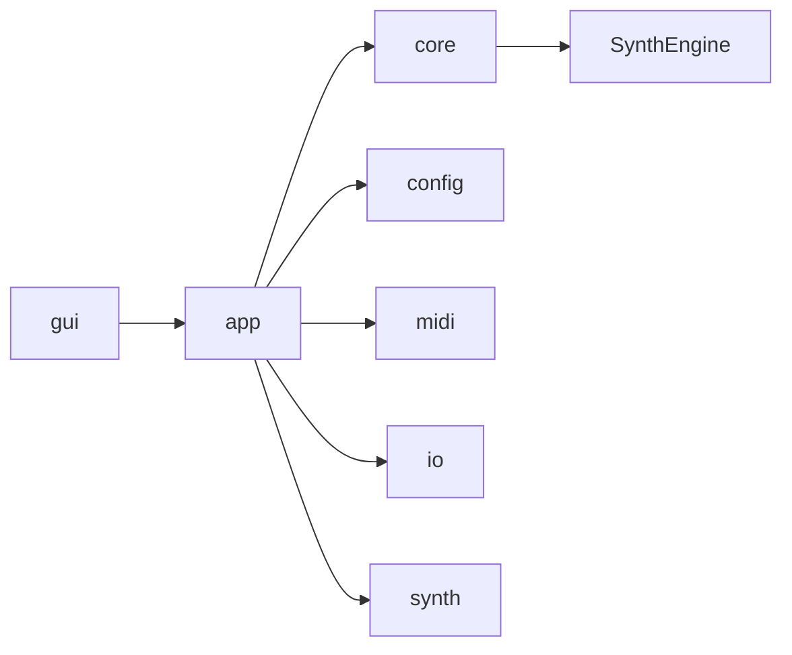

# Module Map

最終更新: 2026-03-08

## Dependency Graph

## Layer Cards

| Layer | Path | Responsibility |
|---|---|---|
| GUI | `src/gui`, `include/gui` | UI描画、UI状態、GUI操作フロー |
| APP | `src/app`, `include/app` | 実行入口、Run制御、CLI/GUI共通実行フロー |
| CORE | `src/core`, `include/core` | appからSynthEngineへの境界 |
| ENGINE | `src/SynthEngine`, `include/SynthEngine` | 合成処理の本体 |
| MIDI | `src/midi`, `include/midi` | MIDI読込、tick/sample変換、pipeline |
| CONFIG | `src/config`, `include/config` | 設定I/O、source registry、resolver |
| IO | `src/io`, `include/io` | パス変換、WAV保存 |
| SYNTH HELPERS | `src/synth`, `include/synth` | 波形・エンベロープなど合成補助 |

## 依存ルール記号

| Signal | ルール | 例 |
|---|---|---|
| `OK` | 許可 | `gui -> app`, `app -> core`, `core -> SynthEngine` |
| `WARN` | 非推奨 | `core -> gui` |
| `NG` | 禁止 | `SynthEngine -> gui` |

## 構造の実装確認ポイント

| 観点 | 確認点 | 参照 |
|---|---|---|
| GUI層 | GUIコードは `src/gui`, `include/gui` に配置される | `src/gui`, `include/gui` |
| 実行層 | 実行制御は `src/app`, `include/app` に配置される | `src/app`, `include/app` |
| 合成層 | 合成本体は `src/SynthEngine`, `include/SynthEngine` に配置される | `src/SynthEngine`, `include/SynthEngine` |
| Config/IO層 | 設定I/OとWAV保存は `src/config`, `src/io` が担当する | `src/config`, `src/io` |

変更影響の確認先は `docs/architecture/README.md` の `Impact Map（変更時の影響先）` を参照。

## Sound パラメータ仕様の正本

- Sound パラメータ仕様は `docs/architecture/` と `docs/synth-methods/foundation-contract.md` を正本とする。
- `docs/SOUND_PARAMETERS.md` は参照導線のみを保持し、仕様値・挙動の重複定義を持たない。
- 方式境界（Waveform / FM / Noise / DrumKit）の判断は本書の責務境界と `SourceRegistry` 契約に従う。
## Foundation契約の境界責務

- source 種別の契約定義（capability / lifecycle / schema）は `docs/synth-methods/foundation-contract.md` を正本として運用する。
- GUI / app / SynthEngine は契約の利用側とし、重複定義を持たない。

## Special Notes

### 依存方向・責務境界

#### 2026-02-25: MIDI読込〜sampleイベント化はapp層で完結し、core/SynthEngineへは確定イベント列のみ渡す
- カテゴリ: 依存方向・責務境界
- 背景: MIDI解析・テンポ変換の仕様を下位層へ混在させると、合成ロジックと境界責務が曖昧になる。
- 判断: `RunMain` で `BuildMIDIPipeline` を完了させ、`RenderWithEngine` には sample軸イベントを渡す。
- 代替案: SynthEngine内部でMIDI tick処理まで担う案。
- 影響範囲: 層責務が明確化され、GUI/CLI双方で同一実行経路を再利用しやすい。
- 関連ファイル: `src/app/RunExecution.cpp`, `src/midi/MIDIPipeline.cpp`, `src/core/RenderGateway.cpp`

#### 2026-02-26: Source別編集の集約点を `GUIChannelEditor` に固定
- カテゴリ: 依存方向・責務境界
- 背景: 音源方式（Waveform/Noise/FM/DrumKit）ごとの編集UIが分散すると、機能追加時に差分漏れと文言不整合が起きやすい。
- 判断: Source切替と編集ウィジェットの主要分岐を `GUIChannelEditor` に集約し、GUI上の責務境界を一本化する。
- 代替案: Sourceごとに別ファイルへ分割し、呼び出し側で都度分岐する案。
- 影響範囲: 追加実装の入口が明確になり、実装者交代時でも変更点を追いやすい。外部説明時も「編集の中心点」が示しやすくなる。
- 関連ファイル: src/gui/GUIChannelEditor.cpp

#### 2026-03-03: GUIの副作用処理を `GUIActions` へ分離
- カテゴリ: 依存方向・責務境界
- 背景: `MainWindow` 側に実行/保存/復旧ロジックが混在すると、描画変更と動作変更が同時発生し回帰追跡が難しくなる。
- 判断: 描画は `MainWindow.inl`、副作用を伴う操作は `GUIActions.cpp`、パラメータ編集は `GUIChannelEditor.cpp` に分離する。
- 代替案: 単一ファイル内で描画と操作を維持する案。
- 影響範囲: UI改修時の影響範囲が狭まり、レビュー時に「見た目変更」と「挙動変更」を分けて検証できる。
- 関連ファイル: src/gui/GUIActions.cpp, src/gui/GUIChannelEditor.cpp, src/gui/main/MainWindow.inl

#### 2026-03-04: `SoundData` の生成責務を `AudioBuffer` 側に固定
- カテゴリ: 依存方向・責務境界
- 背景: 既定サンプルレート/bit深度の初期化が呼び出し側に散在すると、WAV出力条件の不整合が起きやすい。
- 判断: `AudioBuffer.cpp` のコンストラクタで有効な既定値（44.1kHz/16bit）を保証し、初期化責務を境界側へ集約する。
- 代替案: すべての呼び出し側で毎回初期値を指定する案。
- 影響範囲: 実行経路ごとの差異を減らし、外部利用者に対しても「既定出力仕様が常に一定」と説明しやすくなる。
- 関連ファイル: src/core/AudioBuffer.cpp

#### 2026-03-05: `synth` を純粋な信号処理ヘルパー層として固定
- カテゴリ: 依存方向・責務境界
- 背景: 波形生成/ADSR進行に実行状態管理を混ぜると、移植や単体検証時に依存が増えて再利用しづらい。
- 判断: `synth` 層は `Envelope` / `Oscillator` の信号処理APIに限定し、実行制御は上位層（SynthEngine/app）で扱う。
- 代替案: `synth` 側で再生状態や実行コンテキストまで保持する案。
- 影響範囲: 関数単位のテスト容易性が上がり、将来の別ランタイム/別UIへの再利用説明がしやすい。
- 関連ファイル: include/synth/Envelope.h, include/synth/Oscillator.h, src/synth/Envelope.cpp, src/synth/Oscillator.cpp

### 音響アルゴリズム上の制約

#### 2026-02-25: Voice状態はSoAで管理する（AoS互換定義は削除済み）
- カテゴリ: 音響アルゴリズム上の制約
- 背景: AoS（構造体の配列）だと、1sampleごとの更新で必要フィールドが離散し、サンプルごとに繰り返す処理で参照局所性が落ちやすい。
- 判断: レンダ経路は SoA（`Voice`、旧名 `VoicesSoA`）を正規実装とし、2026-03-19 に旧 AoS 互換定義を削除した。
- 代替案: AoSのままレンダする。
- 影響範囲: `Renderer.cpp` の走査は同種データを連続アクセスできる。代わりに `Voices.cpp` 側で配列の同期追加/圧縮管理が必要。
- 関連ファイル: `src/SynthEngine/Internal.h`, `src/SynthEngine/Voices.cpp`, `src/SynthEngine/Renderer.cpp`

#### 2026-02-25: Smoothingは異常値を入口で正規化し、破綻時は即時反映へフォールバック
- カテゴリ: 音響アルゴリズム上の制約
- 背景: GUI/JSON起因のNaN/Infや不正サンプルレートが混入すると、レンダ全体へ異常値が伝播する。
- 判断: `SanitizeFinite` + `ClampWithRange` で有限値化し、無効時定数や無効sampleRateでは `alpha=1.0` で平滑化を無効化（即時反映）する。
- 代替案: 異常入力を例外扱いにしてレンダを中断する案。
- 影響範囲: 音の破綻・発散を抑制し、設定不整合時も処理継続を優先。
- 関連ファイル: `src/SynthEngine/Smoothing.cpp`, `include/SynthEngine/Smoothing.h`

#### 2026-02-25: Modulationは2パス評価で未使用ソースのstep計算を回避
- カテゴリ: 音響アルゴリズム上の制約
- 背景: 1sampleごとの固定コストが増えると、ルート未使用時でもCPU負荷が下がらない。
- 判断: 1パス目で有効routeと使用sourceを判定し、必要なLFO/Envのみstepした後に2パス目で合成。
- 代替案: すべてのsourceを毎sample評価してからroute適用する案。
- 影響範囲: route未使用時の余計な計算を削減。探索2パス化により実装はやや複雑化。
- 関連ファイル: `src/SynthEngine/Modulation.cpp`, `include/SynthEngine/Modulation.h`

ADR記法は `docs/architecture/README.md` の `ADR Card Template` を使用。

#### 2026-02-26: Drum系パラメータの未指定表現を構造体契約で統一
- カテゴリ: 音響アルゴリズム上の制約
- 背景: Drum方式は typeごとに利用パラメータが異なり、未使用値の扱いが曖昧だと保存/読込/GUIで不一致が発生する。
- 判断: `DrumConfig` で「未使用値は 0 または負値で未指定」を契約化し、レンダ側で内部デフォルトにフォールバックする。
- 代替案: typeごとに別構造体へ分割する案。
- 影響範囲: 設定互換を維持しつつUI/JSON/レンダの意味を揃えられる。外部説明でも「未指定時の挙動」を明示できる。
- 関連ファイル: include/SynthEngine/SynthEngine.h

#### 2026-03-03: 重複ノート対応のため `noteInstanceID` を導入
- カテゴリ: 音響アルゴリズム上の制約
- 背景: 同一ch/noteの重なり発音では、`ch+note` だけの照合だと誤った NoteOff が別Voiceを止める可能性がある。
- 判断: `MIDIParser -> Sequencer -> Voice` で `noteInstanceID` を通線し、ID優先で NoteOff 対象を照合する。
- 代替案: 従来どおり `ch+note` のみで照合する案。
- 影響範囲: オーバーラップノート時の発音安定性が向上し、MIDI互換性の説明材料になる。
- 関連ファイル: include/SynthEngine/SynthEngine.h, src/SynthEngine/Internal.h, src/SynthEngine/Voices.cpp

#### 2026-03-04: DrumKit は noteごとに `DrumConfig` 展開して処理
- カテゴリ: 音響アルゴリズム上の制約
- 背景: DrumKit を通常Voice経路と別実装にすると、ミックス/CC/Pitch/エンベロープの挙動差が生じやすい。
- 判断: `Events.cpp` で note -> `DrumConfig` に展開後、通常 `AddVoice` 経路へ流し込む。
- 代替案: DrumKit専用レンダ/イベント経路を新設する案。
- 影響範囲: 単一路線で挙動整合を保ち、追加仕様時の分岐コストを抑えられる。
- 関連ファイル: include/SynthEngine/SynthEngine.h, src/SynthEngine/Events.cpp

#### 2026-03-05: 波形品質と実時間性のバランスをヘルパー層で担保
- カテゴリ: 音響アルゴリズム上の制約
- 背景: 高域のエイリアシング抑制と低コスト処理の両立が不十分だと、品質と実時間性のどちらかを失いやすい。
- 判断: `Oscillator` は polyBLEP 補正と軽量ノイズ近似、`Envelope` は境界条件（0秒attack/release）を明示的に処理する。
- 代替案: 補正なし波形や重い高品位アルゴリズムへ寄せる案。
- 影響範囲: 実時間動作を維持しつつ、外部デモ時の音質劣化（特に高域の折返し）を抑えやすくなる。
- 関連ファイル: include/synth/Envelope.h, include/synth/Oscillator.h, src/synth/Envelope.cpp, src/synth/Oscillator.cpp

### Dependency Direction and Boundaries

#### 2026-03-05: Source編集の集約点を `GUIChannelEditor` に固定し、境界責務を明確化
- Category: Dependency Direction and Boundaries
- Background: Source編集ロジックが画面側へ分散すると、描画変更と編集挙動変更が同時に発生し、回帰切り分けが難しくなる。
- Decision: Source別編集・補助説明の主要責務を `GUIChannelEditor` に固定し、`MainWindow` は画面構成と導線接続に専念させる。
- Alternatives: source方式ごとに `MainWindow` 側へ分岐ロジックを分散配置する案。
- Impact: GUI境界の責務が読みやすくなり、編集機能追加時の修正点が局所化される。
- Related Files: src/gui/GUIChannelEditor.cpp

#### 2026-03-08: 種別判定の境界を GUI直書きから `SourceRegistry` 契約へ移管
- Category: Dependency Direction and Boundaries
- Background: `SourceKind` / variant 直書き判定が GUI と Config に重複すると、契約変更時に境界ごとの不整合が生まれやすい。
- Decision: 種別能力判定は `SourceRegistry` の capability 契約を正とし、GUI側は `SourceCapabilityOf(...)` を参照して分岐する。
- Alternatives: GUI/Configがそれぞれ独自の種別判定ロジックを保持する案。
- Impact: 依存方向を `gui -> config(契約)` に整理し、方式追加時の変更漏れリスクを抑制できる。
- Related Files: include/config/SourceRegistry.h, src/config/SourceRegistry.cpp, src/gui/GUIActions.cpp, src/gui/main/MainWindow.inl

