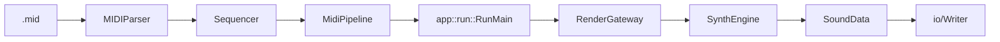
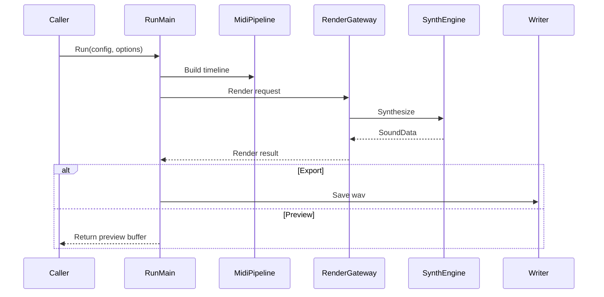

# Runtime Flow

最終更新: 2026-02-23

## End-to-End

## Sequence (Run)

## Run Boundary

| 項目 | 位置 |
|---|---|
| 公開API | `include/AppCore.h` |
| 実行本体 | `src/app/RunExecution.cpp` |
| 保存処理 | `src/app/RunSave.cpp` |
| 既定値適用 | `src/app/RunDefaults.cpp` |
| 統計処理 | `src/app/RunStats.cpp` |

## Preview / Export

| Mode | 振る舞い |
|---|---|
| `Export` | WAV保存を伴う通常実行 |
| `Preview` | GUI内プレビュー用実行 |

キャンセルは `IRunObserver::ShouldCancel()` を介してレンダ中断する。

## MIDI Pipeline

- `src/midi/MIDIParser.cpp`: MIDIイベント解析
- `src/midi/Sequencer.cpp`: tick/sample変換
- `src/midi/MidiPipeline.cpp`: app層向けの統合出力

## Special Notes

この節に、実行順序・中断処理・パフォーマンス最適化などの特殊対応を追記する。
