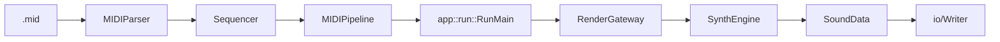
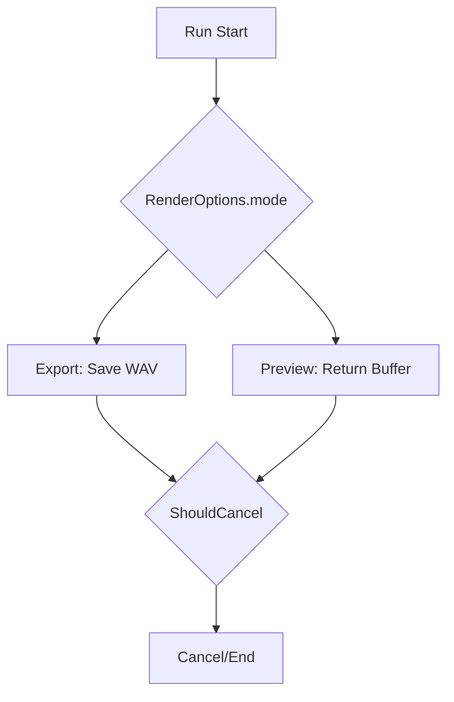

# Runtime Flow

最終更新: 2026-02-25

## End-to-End

## Sequence (Run)

## Mode Branch

## Run Boundary

| 項目 | 位置 |
|---|---|
| 公開API | `include/AppCore.h` |
| 実行本体 | `src/app/RunExecution.cpp` |
| 保存処理 | `src/app/RunSave.cpp` |
| 既定値適用 | `src/app/RunDefaults.cpp` |
| 統計処理 | `src/app/RunStats.cpp` |

## 実装確認ポイント

| 観点 | 確認点 | 参照 |
|---|---|---|
| 実行入口 | `Run(...)` 公開APIが `RunMain` へ集約される | `include/AppCore.h`, `src/SoundGenerate.cpp`, `src/app/RunExecution.cpp` |
| モード分岐 | `RenderOptions.mode` が Export/Preview を分岐する | `src/app/RunExecution.cpp`, `src/app/RunSave.cpp` |
| 中断仕様 | `allowCancel && observer` のときだけ `ShouldCancel()` を使う | `src/app/RunExecution.cpp` |

## MIDI Pipeline

| Component | 役割 |
|---|---|
| `src/midi/MIDIParser.cpp` | MIDIイベント解析 |
| `src/midi/Sequencer.cpp` | tick/sample変換 |
| `src/midi/MIDIPipeline.cpp` | app層向けの統合出力 |

変更影響の確認先は `docs/architecture/README.md` の `Impact Map（変更時の影響先）` を参照。

## Special Notes

### 実行フロー/キャンセル

#### 2026-02-25: Preview経路では保存I/Oを完全に分離
- カテゴリ: 実行フロー/キャンセル
- 背景: GUIプレビューではレンダ結果の試聴が主目的で、毎回WAV保存を行うとI/O待ちが体感遅延になる。
- 判断: `RenderOptions.writeWAV` で保存有無を切り替え、Previewはメモリ返却のみで完了させる。
- 代替案: Export/Previewを同一保存経路に統一し、呼び出し側でファイル破棄する案。
- 影響範囲: Preview時の応答性向上。保存失敗によるPreview失敗を回避。
- 関連ファイル: `src/app/RunSave.cpp`, `src/SoundGenerate.cpp`, `include/AppCore.h`

#### 2026-02-25: キャンセル可否でレンダ経路を事前分岐
- カテゴリ: 実行フロー/キャンセル
- 背景: サンプルごとの繰り返し処理で毎回キャンセル可否を分岐すると、固定コストが増える。
- 判断: `allowCancel && observer` を先に評価し、`shouldCancelObserver` と `neverCancel` の2経路へ分離。
- 代替案: 1経路に統一し、レンダ中に毎回observer有無を判定する案。
- 影響範囲: キャンセル不要ケースの分岐コストを削減し、レンダループを単純化。
- 関連ファイル: `src/app/RunExecution.cpp`, `include/AppCore.h`

#### 2026-03-03: MIDI解析からsampleイベント生成までをパイプライン化
- カテゴリ: 実行フロー/キャンセル
- 背景: 解析・テンポ処理・sample化を分離せずに扱うと、部分変更時の副作用範囲が読みづらくなる。
- 判断: `MIDIParser -> Sequencer -> MIDIPipeline` の段階を固定し、app側は統合出力を受けるだけにする。
- 代替案: app層で個別に解析/変換関数を呼び分ける案。
- 影響範囲: 実行経路の説明責任が明確になり、回帰テスト対象（parser/sequence/pipeline）を分割管理しやすくなる。
- 関連ファイル: include/midi/MIDIParser.h, include/midi/Sequencer.h, src/midi/MIDIParser.cpp, src/midi/MIDIPipeline.cpp, src/midi/Sequencer.cpp

#### 2026-03-04: 既定 `SoundData` を有効な出力条件で初期化
- カテゴリ: 実行フロー/キャンセル
- 背景: バッファ初期値が実行経路ごとに異なると、キャンセルや失敗時に下流処理の前提が揺らぐ。
- 判断: `SoundData` 既定構築時に 44.1kHz/16bit/1秒を保証し、最低限の出力契約を満たす。
- 代替案: 呼び出し側で毎回初期値を設定する案。
- 影響範囲: 失敗時や初期状態でもI/O境界の前提が安定し、運用時の再現性を保ちやすい。
- 関連ファイル: src/core/AudioBuffer.cpp

#### 2026-03-05: app-core境界を `RenderGateway` の単一入口に固定
- カテゴリ: 実行フロー/キャンセル
- 背景: app層が直接SynthEngine実装へ依存すると、差し替え時に呼び出し側改修が広がる。
- 判断: `RenderWithEngine` を単一入口として保持し、実行境界の依存方向を固定する。
- 代替案: app層から `RenderMIDIEvents` を直接呼ぶ案。
- 影響範囲: 将来の実装差し替え（エンジン変更/テストダブル導入）時も呼び出し側の変更を最小化できる。
- 関連ファイル: include/core/AudioBuffer.h, include/core/RenderGateway.h, src/core/AudioBuffer.cpp

### MIDI時間変換

#### 2026-02-25: 同tickイベント順序を Control -> NoteOff -> NoteOn に固定
- カテゴリ: MIDI時間変換
- 背景: 同一tickで順序が揺れると、音切れやノート重なりの結果が不安定になる。
- 判断: tickソート時に優先度を定義し、Control/PitchBendを先行、次にNoteOff、最後にNoteOnで処理。
- 代替案: 入力順依存のまま処理する案。
- 影響範囲: 同時刻イベントの再現性を改善し、レンダ結果の揺れを抑制。
- 関連ファイル: `src/midi/Sequencer.cpp`, `include/midi/Sequencer.h`

ADR記法は `docs/architecture/README.md` の `ADR Card Template` を使用。

#### 2026-03-03: 重複ノート追跡のため `noteInstanceID` を通線
- カテゴリ: MIDI時間変換
- 背景: 同一ch/noteの重なりで NoteOff 対象が曖昧だと、発音切れや残留音が発生しやすい。
- 判断: `MIDIParser` でID採番し `Sequencer`/`MIDIPipeline` を通して音源側までIDを引き継ぐ。
- 代替案: `ch+note` のみでNoteOff照合する案。
- 影響範囲: 重複ノートの再現性が改善し、MIDI互換性に関する外部説明がしやすくなる。
- 関連ファイル: include/midi/MIDIParser.h, include/midi/Sequencer.h, src/midi/MIDIParser.cpp, src/midi/MIDIPipeline.cpp, src/midi/Sequencer.cpp

#### 2026-03-04: Running Status 異常系を安全側で扱う
- カテゴリ: MIDI時間変換
- 背景: Running Status が Meta/SysEx 後に不正継続すると、イベント誤解釈で時系列が破綻する。
- 判断: Meta/SysExでrunning statusを無効化し、不成立時はトラック読み取りを安全側で打ち切る。加えてwindow再生時にCC/Pitchの先頭補完を行う。
- 代替案: 壊れた入力でも解釈継続を試みる案。
- 影響範囲: 異常MIDIでの暴走を抑えつつ、部分再生でも制御状態を再現しやすくなる。
- 関連ファイル: src/midi/MIDIParser.cpp, src/midi/MIDIPipeline.cpp, src/midi/Sequencer.cpp

### Runtime Flow and Cancellation

#### 2026-03-05: `defaultWave` 導線を削除し、Run -> MIDI pipeline 契約を簡素化
- Category: Runtime Flow and Cancellation
- Background: `defaultWave` は実行経路で実質未使用だったため、Run引数とMIDIイベント構造に残ると「契約上は必要だが効果がない」状態になる。
- Decision: `AppConfig` / `BuildMIDIPipeline` / `BuildSampleEvents` から `defaultWave` を削除し、Run経路の入力契約を実使用項目に一致させる。
- Alternatives: 互換キーとして契約に残し、内部で無視する案。
- Impact: 実行境界の引数が減り、Run経路の理解と保守が容易になる。未使用契約由来の誤設定も抑制できる。
- Related Files: include/AppCore.h, include/midi/MIDIPipeline.h, include/midi/Sequencer.h, src/app/RunDefaults.cpp, src/app/RunExecution.cpp

