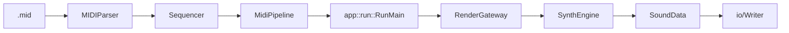
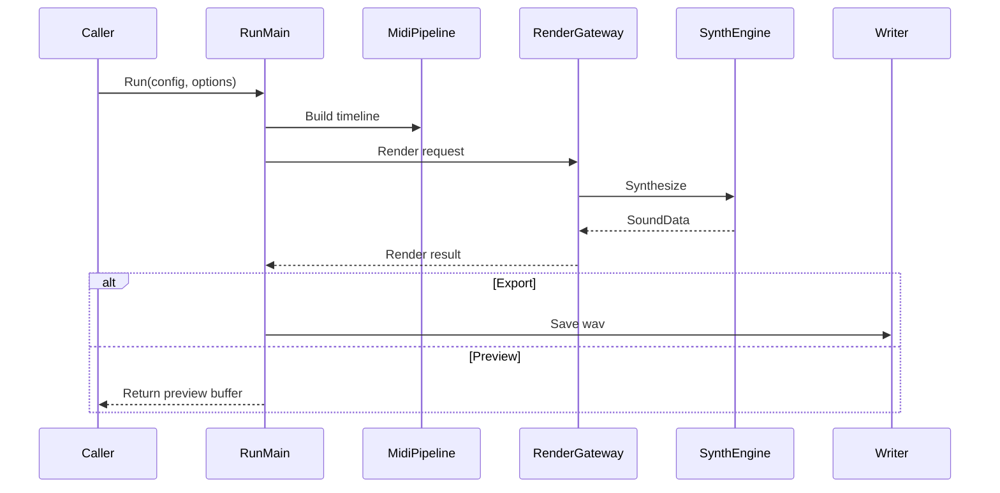
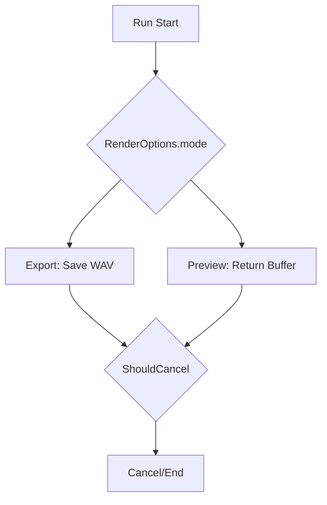

# Runtime Flow

最終更新: 2026-02-25

## End-to-End

## Sequence (Run)

## Mode Branch

## Run Boundary

| 項目 | 位置 |
|---|---|
| 公開API | `include/AppCore.h` |
| 実行本体 | `src/app/RunExecution.cpp` |
| 保存処理 | `src/app/RunSave.cpp` |
| 既定値適用 | `src/app/RunDefaults.cpp` |
| 統計処理 | `src/app/RunStats.cpp` |

## 実装確認ポイント

| 観点 | 確認点 | 参照 |
|---|---|---|
| 実行入口 | `Run(...)` 公開APIが `RunMain` へ集約される | `include/AppCore.h`, `src/SoundGenerate.cpp`, `src/app/RunExecution.cpp` |
| モード分岐 | `RenderOptions.mode` が Export/Preview を分岐する | `src/app/RunExecution.cpp`, `src/app/RunSave.cpp` |
| 中断仕様 | `allowCancel && observer` のときだけ `ShouldCancel()` を使う | `src/app/RunExecution.cpp` |

## MIDI Pipeline

| Component | 役割 |
|---|---|
| `src/midi/MIDIParser.cpp` | MIDIイベント解析 |
| `src/midi/Sequencer.cpp` | tick/sample変換 |
| `src/midi/MidiPipeline.cpp` | app層向けの統合出力 |

変更影響の確認先は `docs/architecture/README.md` の `Impact Map（変更時の影響先）` を参照。

## Special Notes

### 実行フロー/キャンセル

#### 2026-02-25: Preview経路では保存I/Oを完全に分離
- カテゴリ: 実行フロー/キャンセル
- 背景: GUIプレビューではレンダ結果の試聴が主目的で、毎回WAV保存を行うとI/O待ちが体感遅延になる。
- 判断: `RenderOptions.writeWav` で保存有無を切り替え、Previewはメモリ返却のみで完了させる。
- 代替案: Export/Previewを同一保存経路に統一し、呼び出し側でファイル破棄する案。
- 影響範囲: Preview時の応答性向上。保存失敗によるPreview失敗を回避。
- 関連ファイル: `src/app/RunSave.cpp`, `src/SoundGenerate.cpp`, `include/AppCore.h`

#### 2026-02-25: キャンセル可否でレンダ経路を事前分岐
- カテゴリ: 実行フロー/キャンセル
- 背景: サンプルごとの繰り返し処理で毎回キャンセル可否を分岐すると、固定コストが増える。
- 判断: `allowCancel && observer` を先に評価し、`shouldCancelObserver` と `neverCancel` の2経路へ分離。
- 代替案: 1経路に統一し、レンダ中に毎回observer有無を判定する案。
- 影響範囲: キャンセル不要ケースの分岐コストを削減し、レンダループを単純化。
- 関連ファイル: `src/app/RunExecution.cpp`, `include/AppCore.h`

#### 2026-03-03: TODO (auto-generated)
- カテゴリ: 実行フロー/キャンセル
- 背景:
- 判断:
- 代替案:
- 影響範囲:
- 関連ファイル: include/midi/MIDIParser.h, include/midi/Sequencer.h, src/midi/MIDIParser.cpp, src/midi/MidiPipeline.cpp, src/midi/Sequencer.cpp

#### 2026-03-04: TODO (auto-generated)
- カテゴリ: 実行フロー/キャンセル
- 背景:
- 判断:
- 代替案:
- 影響範囲:
- 関連ファイル: src/core/AudioBuffer.cpp

#### 2026-03-05: TODO (auto-generated)
- カテゴリ: 実行フロー/キャンセル
- 背景:
- 判断:
- 代替案:
- 影響範囲:
- 関連ファイル: include/core/AudioBuffer.h, include/core/RenderGateway.h, src/core/AudioBuffer.cpp

### MIDI時間変換

#### 2026-02-25: 同tickイベント順序を Control -> NoteOff -> NoteOn に固定
- カテゴリ: MIDI時間変換
- 背景: 同一tickで順序が揺れると、音切れやノート重なりの結果が不安定になる。
- 判断: tickソート時に優先度を定義し、Control/PitchBendを先行、次にNoteOff、最後にNoteOnで処理。
- 代替案: 入力順依存のまま処理する案。
- 影響範囲: 同時刻イベントの再現性を改善し、レンダ結果の揺れを抑制。
- 関連ファイル: `src/midi/Sequencer.cpp`, `include/midi/Sequencer.h`

ADR記法は `docs/architecture/README.md` の `ADR Card Template` を使用。

#### 2026-03-03: TODO (auto-generated)
- カテゴリ: MIDI時間変換
- 背景:
- 判断:
- 代替案:
- 影響範囲:
- 関連ファイル: include/midi/MIDIParser.h, include/midi/Sequencer.h, src/midi/MIDIParser.cpp, src/midi/MidiPipeline.cpp, src/midi/Sequencer.cpp

#### 2026-03-04: TODO (auto-generated)
- カテゴリ: MIDI時間変換
- 背景:
- 判断:
- 代替案:
- 影響範囲:
- 関連ファイル: src/midi/MIDIParser.cpp, src/midi/MidiPipeline.cpp, src/midi/Sequencer.cpp

