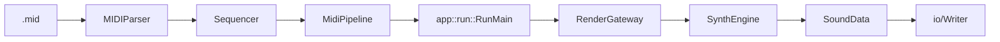
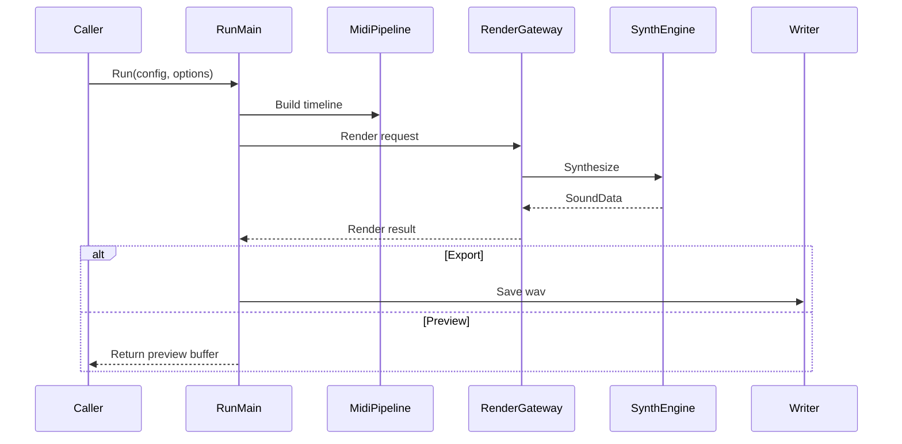
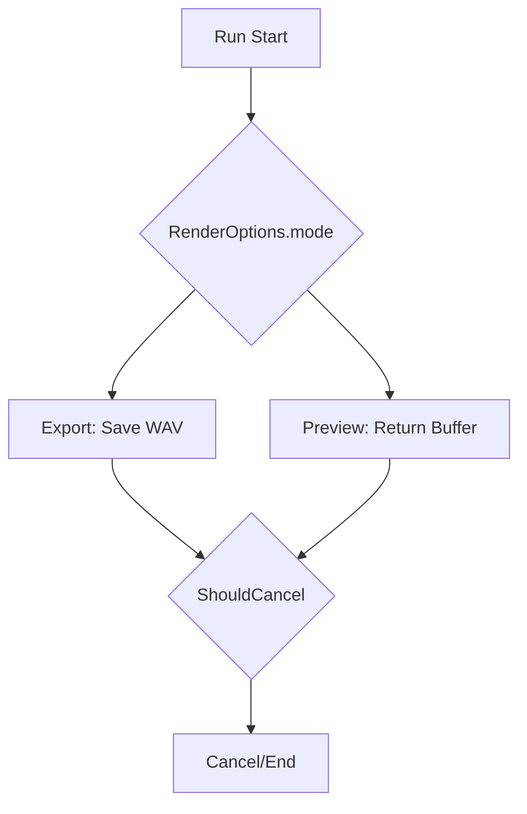
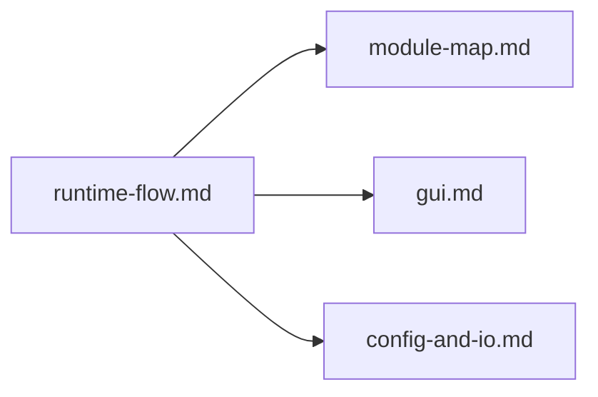

# Runtime Flow

最終更新: 2026-02-24

## End-to-End

## Sequence (Run)

## Mode Branch

## Run Boundary

| 項目 | 位置 |
|---|---|
| 公開API | `include/AppCore.h` |
| 実行本体 | `src/app/RunExecution.cpp` |
| 保存処理 | `src/app/RunSave.cpp` |
| 既定値適用 | `src/app/RunDefaults.cpp` |
| 統計処理 | `src/app/RunStats.cpp` |

## Before / After (Execution Path)

| 観点 | Before | After |
|---|---|---|
| 実行経路 | GUI/CLI説明が分離しやすい | 共通Run経路として説明統一 |
| モード説明 | 文だけで分かりにくい | `Mode Branch` 図で可視化 |
| 中断仕様 | 注釈中心 | `ShouldCancel` を明示 |

## MIDI Pipeline

| Component | 役割 |
|---|---|
| `src/midi/MIDIParser.cpp` | MIDIイベント解析 |
| `src/midi/Sequencer.cpp` | tick/sample変換 |
| `src/midi/MidiPipeline.cpp` | app層向けの統合出力 |

## Impact Map (When This Changes)

## Special Notes

### 実行フロー/キャンセル

- 現在、特記すべき例外なし。

### MIDI時間変換

- 現在、特記すべき例外なし（tick/sample変換ポリシー変更時に追記）。

### ADR Card (Template)

| 項目 | 内容 |
|---|---|
| 背景 | |
| 判断 | |
| 代替案 | |
| 採用理由 | |
| 影響範囲 | |
| 関連ファイル | |
